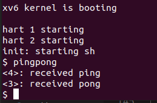
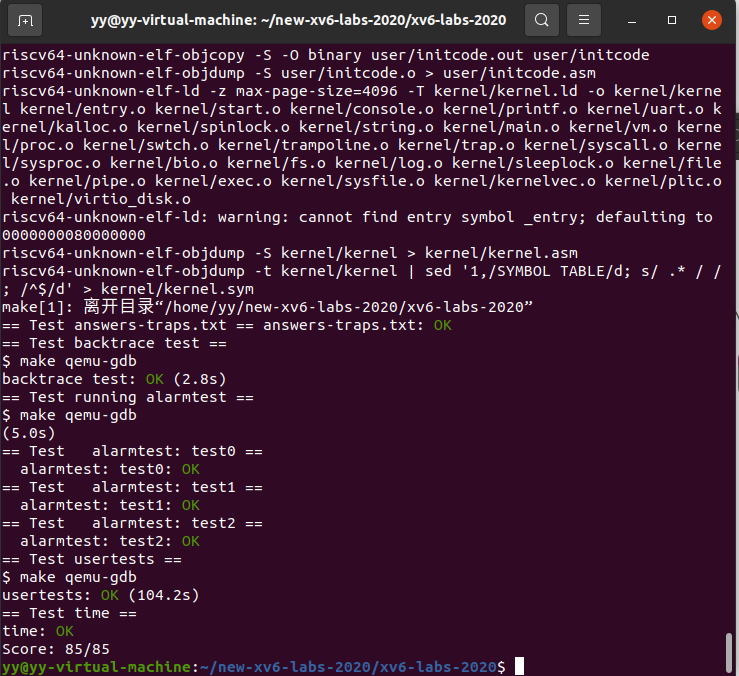

# 实验报告

[toc]

## 1. Lab Utilities

### 1.1 Boot xv6（easy）

####  1）实验目的

利用qemu启动xv6

#### 2）实验过程

+ 获取实验用的 xv6 源码并切换到 util 分支

  ```
  git clone git://g.csail.mit.edu/xv6-labs-2020
  cd xv6-labs-2020
  git checkout util
  ```

  

+ 构建并运行xv6

  ```
  make qemu
  ```

  

+ 在xv6中使用命令测试：

  + 使用ls列出文件：

    ```
    ls
    ```

    

  + 查看运行进程：`ctrl+p`

    在xv6中，无ps命令

    

    结果可以得到两行，一行为init，一行为sh

+ 退出xv6：`先按 Ctrl+a, 再按 x 键.`

  

#### 3）实验中遇到的问题和解决方法

 1. 一开始使用`git clone`获取labs文件时ubuntu显示git：未找到命令

    + 解决方法：命令安装git：

      ```
      sudo apt install git
      ```

#### 4）实验心得

通过该实验，自己初步了解了操作系统的启动过程，为自己之后的实验打下了基础

### 1.2 sleep（easy）

#### 1）实验目的

为xv6实现UNIX程序sleep，sleep应该暂停用户指定的ticks数，并将解决方案写在文件user/sleep.c中。

#### 2）实验过程

+ 切换分支至util

  ```
  git checkout util
  ```

+ 新建一个sleep.c文件在util分支的user文件夹中,并编写代码。主要实现以下功能：

  + 能根据用户指定的时间暂停
  + 如果用户未指定时间（即没有带参数）需要报错并终止程序
  + 用户输入参数为字符串，将字符串转换为数字
  + 用exit退出程序

  得到以下关键代码：

  ```c
  #include "../kernel/types.h"  //kernel当中的类型定义头文件
  #include "../user/user.h"     //user当中实现的有关函数的头文件
  
  int main(int argc,char*argv[])
  {
      int ticks=0;
      /*if语句用于判断用户是否指定时间*/
      if(argc!=2)
      {
          fprintf(2,"usage: sleep sleep_number \n");//2代表标准错误输出
  		exit(1);
      }
      
      ticks=atoi(argv[1]);
      sleep(ticks);
      exit(0);
  }
  ```

+ 运行程序查看结果：

  ```
  make qemu
  sleep 10
  ```

  可以观察到执行上述命令后系统会陷入一段时间的停止后才跳出下一次命令输入的指示，说明成功暂停

+ 回到主目录，通过`make grade`查看程序是否通过测试：

  ```
  ./grade-lab-util sleep
  ```

  得到如下结果：

  

  说明测试通过

#### 3）实验中遇到的问题和解决方法

暂无

#### 4）实验心得

自己通过该实验，第一次的学会了调用系统提供的已有函数来完成自己所需要的功能，提高了自己在完成新的功能时利用系统调用的能力。

### 1.3 pingpong (easy)

#### 1）实验目的

编写一个程序，使用UNIX系统调用在两个进程之间创建一对管道实现父子程序传递信息，以加深对管道的理解。

#### 2）实验过程

1. 我们首先定义两个`int[2]`的数组，用来代表两个管道，并存储他们的fd，调用管道创建函数`pipe`来进行管道的创建。

   ```c
   int fd1[2];//0 is read,1 is write
   int fd2[2];
   char buf[4];//"ping" or "pong"
   
   pipe(fd1);
   pipe(fd2);
   ```

2. 调用fork（）创建进程，并判断是否为子进程。

3. 如果是子进程，父进程会向子进程发送一个字节，子进程打印提示信息“pid：receive ping”，其中pid是通过getpid（）获取的进程ID。该步通过以下代码完成，其中buf变量存储了发送的字节，子进程通过管道1、read读出内容。

   ```c
   read(fd1[0],&buf,sizeof(buf));
   printf("%d: received ping\n", pid);
   ```

   然后将管道上的字节写给父进程：

   ```c
   write(fd2[1],"a",sizeof(buf));
   ```

   这代表子进程通过管道2的写端将字节写入父进程；

   同时对于子进程，读写之前需要关闭父管道的写端，子管道的读端；对于父进程，读写之前需要关闭父管道的读端，子管道的写端，因此在所有读写操作前需要先进行对应关闭：

   ```c
   close(fd1[1]);
   close(fd2[0]);
   ```

4. 如果是父进程，父进程应该从子进程读取字节，打印"\<pid>: received pong"，然后退出：

   ```c
   //parent
       else 
       {
           int pid=getpid();
   
           //close read of parent and write of child
           close(fd1[0]);
           close(fd2[1]);
   
           //write to child
           write(fd1[1],"b",sizeof(buf));
   
           //parent receive "pong" and print
           read(fd2[0],&buf,sizeof(buf));
           printf("%d: received pong\n", pid);
   
           //等待进程子退出
           wait(0);
   	    exit(0);
       }
   ```

5. 将pingpong加入`makefile`文件中的` UPROGS`中：

   

6. `make qemu`启动并运行命令`pingpong`，得到如下结果：

   

7. 运行`./grade-lab-util pingpong`命令以测试程序，得到如下结果：

   

#### 3）实验中遇到的问题和解决方法

自己一开始对管道的创建和向管道内传送数据的了解不是充分，在最初无法成功向管道内传输数据，自己通过查阅有关资料，如知乎和CSDN等，加深了对管道的了解，从而解决了该问题

#### 4）实验心得

自己通过该实验，了解了管道的有关知识，学会了如何在操作系统中在两个进程之间创建一对管道实现父子程序传递信息，为自己下面的primes实验打下了基础

### 1.4 primes (moderate)/(hard)

#### 1）实验目的

使用管道编写一个并发版本的素数筛函数,使用`pipe`和`fork`建立管道。

#### 2）实验过程

+ 首先在主进程中创建管道，利用fork创建子进程，判断如果是父进程，则从写端向子进程逐个发送2-35 int型数据；

  ```c
  int parent_fd[2];
      pipe(parent_fd);
      if (fork())
      {
          close(parent_fd[0]);
          int i;
          for (i = 2; i < 36; i++)
          {
              write(parent_fd[1], &i, sizeof(int));
          }
          close(parent_fd[1]);
      }
  ```

+ 在子进程中读出第一个数，设为base，并判断管道是否为空，如果为空则退出。并已知子进程读到的第一个数一定是素数，所以输出；

  ```c
  int base;
  if (read(input_fd, &base, sizeof(int)) == 0)
  {
      exit(0);
  }
  printf("prime %d\n", base);
  ```

+ 再创建一个管道，继续读数，如果该数不能被base整除，则有可能是素数，发送给下一子进程，循环该过程直至read返回0；

  ```c
  int n;
  int eof;
  do
  {
      eof = read(input_fd, &n, sizeof(int));
      if (n % base != 0)
      {
          write(p[1], &n, sizeof(int));
      }
  } while (eof);
  ```

+ 继续fork创建子进程，重复上述过程，直至退出程序。

+ 将primes加入`makefile`文件中的` UPROGS`中

+ `make qemu`启动并运行命令`primes`，得到如下结果：

  

+ 运行`./grade-lab-util primes`命令以测试程序，得到如下结果：

  

#### 3）实验中遇到的问题和解决方法

1. 一开始不知道在什么地方将素数输出

   在查阅相关资料后才知道，子进程读出的第一个数一定是素数，此时输出

2. 一开始写的时候，在父子进程中都跳转到了prime函数进行素数判断，对父子进程在素数筛当中的作用没有区分清楚，也没有弄懂父子进程的区别。

   父进程只负责通过管道向子进程写数据，而不需要进行下一步的判断操作，子进程则要在父进程写完数据后读取数据，并继续将可行数发送给下一子进程，因此递归的应该是子进程，父进程并不需要调用递归函数。

#### 4）实验心得

通过该实验，我学到了最多的是对实验指导书认真观看的重要性以及对知识理解完全的重要性，我们必须得清晰的了解某个知识点之后，才能开始写代码，否则代码写出来问题会很多。

### 1.5 find(moderate)

#### 1）实验目的

编写一个简单版本的查找程序：查找目录树中带有特定名称的所有文件。通过实现`find`函数，提高我们对系统内文件标识的理解和认识，同时也训练了我们对递归的理解能力。

#### 2）实验过程

+ 本实验和`ls`函数的代码基本上一致，首先需要定义一个`fmtname`函数，来对传入的`path`数据进行处理，提取出文件名。

该函数输入参数为一个路径字符串作为输入，然后从路径中提取出文件名，最后返回指向文件名的指针

```c
char *fmtname(char *path)
{
    char *p;

    // Find first character after last slash.
    for (p = path + strlen(path); p >= path && *p != '/'; p--)
        ;
    p++;

    return p;
}
```

+ 接着我们对读取到的文件的格式进行判断，判断它是一个**普通文件**还是**目录文件**，如果是普通文件，文件名即为路径名，直接和`path`进行判断，如果相同，则说明找到了文件，如果不相同，则继续寻找；如果是目录文件，则进入目录文件当中，并对其进行判断，以此循环往复，直到遍历完所有文件或者找到我们的目标文件。

```c
   //find的核心实现代码
    switch (st.type)
    {
    case T_FILE:
        if (strcmp(fmtname(path), filename) == 0) //此时说明找到对应的文件
            printf("%s\n", path);
        break;

    case T_DIR:
        if (strlen(path) + 1 + DIRSIZ + 1 > sizeof buf)
        {
            printf("find: path too long\n");
            break;
        }
        strcpy(buf, path);
        p = buf + strlen(buf);
        *p++ = '/';
        while (read(fd, &de, sizeof(de)) == sizeof(de))
        {
            //跳过不符合要求的数据
            if (de.inum == 0 || strcmp(de.name, "..") == 0 || strcmp(de.name, ".") == 0)
                continue;
            memmove(p, de.name, DIRSIZ);
            p[DIRSIZ] = 0;
            
            find(buf, filename);
        }
        break;
    }
```

+ 将find加入`makefile`文件中的` UPROGS`中

+ `make qemu`启动并运行命令`primes`，得到如下结果：

  

+ 运行`./grade-lab-util find`命令以测试程序，得到如下结果：

  

#### 3）实验中遇到的问题和解决方法

一开始写时没有考虑路径本身就是一个普通文件，可以直接而是将其都默认为了目录文件，所有文件都是进入目录文件后再进行判断，导致在测试时有些结果无法正确查找。在修正后在一开始的判断加入了对路径文件类型的判断，如果是普通文件，则直接将文件名与`path`对比。

#### 4）实验心得

通过完成该实验，我对操作系统中的文件系统和目录树结构有了更深的了解。我理解了文件系统是如何组织文件和目录，并在操作系统中进行管理的，从而能够完成实验中逐层进行目标文件查找的要求；同时学会从路径中提取文件名以及区分普通文件和目录文件。

### 1.6 xargs(moderate)

#### 1）实验目的

编写一个简单版本的 UNIX xargs 程序，从标准输入中读取行，并为每一行运行一个命令，同时将该行作为参数提供给命令。

#### 2）实验过程

+ 首先读取`xargs`后面所对应要执行的程序及其所对应的参数。

```c
    for(int i=1;i<argc;i++)
    {
        full_argv[i-1]=argv[i];//把参数赋值给full_argv,浅复制
    }

    full_argv[argc]=0;//说明此时已到结尾

```

+ 在读取完`xargs`所对应的命令参数之后，我们对标准输入当中的内容进行读取，并将其存储在我们之前记录参数的数组当中。

```c
//从标准输入当中读取内容的核心代码
while(1)
{
    len=read(0,&buf[i],1);//从标准输入当中一字节一字节读取数据
    if(len==0||buf[i]=='\n')
        break;
    i++;
}
if(i==0)//说明此时没有数据
    break;

buf[i]=0;//截断字符串
full_argv[argc-1]=buf;
```

+ 最后调用fork函数，创建一个子进程，然后在子进程当中调用`exec`函数并传入我们处理好的参数，便实现了`xargs`的功能。

```c
if(fork()==0)//说明为子进程
{
    exec(full_argv[0],full_argv);
    exit(0);
}
else
{
    wait(0);
}
```

#### 3）实验中遇到的问题和解决方法

自己一开始对exec函数的调用方法一开始并不是很理解，一直不太清楚exec需要传入的参数有什么，自己通过查阅官方文档，通过阅读官方文档当中的定义，从而加深了对exec函数的理解，从而解决了该问题

#### 4）实验心得

通过该实验，我学会了如何从标准输入中一字节一字节的读取数据，并通过使用fork（）和exec（）等系统调用完成了最基本的进程控制；同时在编写该程序时，需要我具备命令行参数解析的能力，以解析命令行参数来处理用户输入的选项和参数。

## 2. Lab: system calls

### 2.1 System call tracing (moderate)

#### 1）实验目的

在本实验中需要在xv6内核中添加一个新的系统调用跟踪功能。需通过输入参数指定要跟踪的系统调用，对应的系统调用即将返回时会打印一行信息。这行信息应包含进程id，系统调用的名称和返回值。不需要打印系统调用的参数。同时trace系统调用应该对调用它的进程以及之后通过fork创建的子进程启用跟踪，从而可以通过调用trace来控制哪些系统调用需要被跟踪，在调试后续的实验时有助于定位问题。

#### 2）实验过程

+ 由于`trace`函数也为一个系统调用，所以我们需要在`user/user.h`，`user/usys.pl`，`kernel/syscall.c`和`kernel/syscall.h`当中添加为`trace`系统调用所需的一些定义，并且在`kernel/syscall.c`当中添加打印系统调用的名称时所需要的数组。

  + 在`kernel/syscall.h`中宏定义 `#define SYS_trace  22`

  + 在`user/usys.pl`中新增一个`entry("trace")`

  + 在`kernel/syscall.c`中新增sys_trace函数定义

    ```c
    extern uint64 sys_trace(void);//line 107
    [SYS_trace]   sys_trace,//line	131
    ```

  + 在`kernel/syscall.c`中新建一个数组存放system_call的名称(134行)

    ```c
    char *sysname[] = {
    [SYS_fork]    "fork",
    [SYS_exit]    "exit",
    [SYS_wait]    "wait",
    [SYS_pipe]    "pipe",
    [SYS_read]    "read",
    [SYS_kill]    "kill",
    [SYS_exec]    "exec",
    [SYS_fstat]   "stat",
    [SYS_chdir]   "chdir",
    [SYS_dup]     "dup",
    [SYS_getpid]  "getpid",
    [SYS_sbrk]    "sbrk",
    [SYS_sleep]   "sleep",
    [SYS_uptime]  "uptime",
    [SYS_open]    "open",
    [SYS_write]   "write",
    [SYS_mknod]   "mknod",
    [SYS_unlink]  "unlink",
    [SYS_link]    "link",
    [SYS_mkdir]   "mkdir",
    [SYS_close]   "close",
    [SYS_trace]   "trace",
    [SYS_sysinfo] "sysinfo"
    };
    ```

+ 在`kernel/proc.h`的`proc`结构体当中添加一个变量用于存放mask码

  ```c
  int mask;  // 每个进程要显示的系统调用对应的数字
  ```

+ 在`kernel/sysproc.c`中写trace函数的具体实现

  ```c
  uint64 sys_trace(void)
  {
    int mask;
    if(argint(0, &mask) < 0)
      return -1;
    
    myproc()->mask = mask;
    return 0;
  }
  ```

+ 分析`user/usys.pl`可知，汇编语言代码会将系统调用号压入`a7`寄存器当中，所以我们在`kernel/syscall.c`的`syscall`函数中，把`a7`寄存器的值赋给`num`变量来进行记录，然后进行系统调用号正确性的判断，然后对系统调用号进行输出，从而实现根据mask值打印system call。

  ```c
    num = p->trapframe->a7;//读取系统调用号
    if(num > 0 && num < NELEM(syscalls) && syscalls[num]) 
    {
      p->trapframe->a0 = syscalls[num]();
  
      if ((1<<num)&p->mask)//说明此时匹配上了一个系统调用
      {
        printf("%d: syscall %s -> %d\n",p->pid,sysname[num],p->trapframe->a0);
      }
    }
  ```

+ 创建子进程时，子进程应该复制父进程的mask值以便于追踪，因此在`kernel/proc.c`中fork函数调用时，子进程需要复制父进程的mask

  ```c
   np->mask=p->mask;//将mask的值传递给子进程（line 286）
  ```

+ 将 `$U/_trace`加入`Makefile`文件的`UPROGS`中 

+ 对照实验手册运行`make qemu`进行测试

  

  

  

+ `./grade-lab-syscall trace`验证程序是否通过测试

  

#### 3）实验中遇到的问题和解决方法

+ 在一开始实验的时候，对整个系统调用的流程还不是很清楚，也不清楚要怎么把系统调用号传递到对应的函数当中，特别是不清楚怎么样才能取得系统调用，而且把系统调用号传递到对应的函数当中。

​		解决方法：通过阅读`usys.pl`函数我了解到，汇编函数会把系统调用号压入`a7`栈中，然后从`a7`寄存器当中便可以取到对应的系统调用号。

#### 4）实验心得

​	本实验让我对系统调用的过程有了一个清晰的认识，并且通过该实验，我也了解到了不同寄存器当中的使用规则，让我对不同寄存器的作用的理解又加深了一步。

### 2.2 sysinfo (moderate)

#### 1）实验目的

在本实验中，需要添加一个系统调用 sysinfo，用于收集运行系统的信息。系统调用需要一个参数：指向 struct sysinfo 的指针，并返回可用内存的字节数和可用进程数。

#### 2）实验过程

+ 同上一个实验，`sysinfo`也为一个系统调用，所以需要在不同文件中为`sysinfo`系统调用添加所需的一些定义。

  + 在`kernel/syscall.h`中添加`#define SYS_sysinfo 23`

  + 在`user/usys.pl`中添加`entry("sysinfo");`

  + 在`user/user.h`中添加sysinfo结构体、sysinfo函数声明

    ```c
    struct sysinfo;//line 3
    int sysinfo(struct sysinfo *);//line 45
    ```

  + 在`kernel/syscall.c`中添加sys_trace函数定义

    ```c
    extern uint64 sys_sysinfo(void);
    ```

  + 在`kernel/syscall.c`中函数指针数组新增sys_trace；sysname变量中新增一个"sysinfo"元素

    ```c
    [SYS_sysinfo] sys_sysinfo//line 133
    ```

    ```c
    char *sysname[] = {
    [SYS_fork]    "fork",
    [SYS_exit]    "exit",
    [SYS_wait]    "wait",
    [SYS_pipe]    "pipe",
    [SYS_read]    "read",
    [SYS_kill]    "kill",
    [SYS_exec]    "exec",
    [SYS_fstat]   "stat",
    [SYS_chdir]   "chdir",
    [SYS_dup]     "dup",
    [SYS_getpid]  "getpid",
    [SYS_sbrk]    "sbrk",
    [SYS_sleep]   "sleep",
    [SYS_uptime]  "uptime",
    [SYS_open]    "open",
    [SYS_write]   "write",
    [SYS_mknod]   "mknod",
    [SYS_unlink]  "unlink",
    [SYS_link]    "link",
    [SYS_mkdir]   "mkdir",
    [SYS_close]   "close",
    [SYS_trace]   "trace",
    [SYS_sysinfo] "sysinfo" //新增
    };
    ```

+ 完成上述声明后，开始正式编写sysinfo。首先我们在`kernel/kalloc.c`中计算系统当中的`freemem`，通过参考`kernel/kalloc.c`文件当中的`kalloc`函数和`kfree`函数可以看出，内核是通过一个`kmem.list`链表来维护空闲内存，所以我们计算出当前空闲的页表数，然后乘以页表大小便可以了。

  ```c
  uint64 getfreemem(void) 
  {
      uint64 n;
      struct run *r;
      // 遍历kmem.freelist链表
      for (n = 0, r = kmem.freelist; r; r = r->next) 
      {
          ++n;
      }
      return n * PGSIZE;
  }
  ```

+ 然后我们在`kernel/proc.c`中计算系统当中的进程数，通过参考`kernel/proc.c`文件中的 `allocproc` 和 `freeproc` 函数可以知道，进程是通过数组`proc[NPROC]`来进行维护的，所以我们直接遍历这个数组便可以知道整个内核当中的正在运行的线程数。

  ```c
  uint64 getnproc(void) 
  {
      uint64 n;
      struct proc *p;
      // 遍历proc数组, 找非UNUSED状态进程
      for(n=0, p = proc; p < &proc[NPROC]; ++p) 
      {
          if(p->state != UNUSED) 
          {
              ++n;
          }
      }
      return n;
  }
  ```

+ 接着在`kernel/defs.h`当中添加这两个函数的声明

  ```c
  uint64          getfreemem(void);//line 66
  uint64          getnproc(void);//line 108
  ```

+ 在`kernel/sysproc.c`当中实现`sys_sysinfo`系统调用，在该函数当中需要通过`copyout`函数将`sysinfo`结构体从内核态拷贝到用户态。

  ```c
  uint64 sys_sysinfo(void) 
  {
      uint64 info_addr;
      struct sysinfo info;
  
      if (argaddr(0, &info_addr) < 0) 
      {
          return -1;
      }
      
      // 计算freemem和nproc
      info.freemem = getfreemem();
      info.nproc = getnproc();
      // 将结构体由内核态拷贝至用户态
      if (copyout(myproc()->pagetable, info_addr,(char *) &info, sizeof(info)) < 0) 
      {
          return -1;
      }
      return 0;
  }
  ```

+ 将 `	$U/_sysinfotest\`加入`Makefile`文件的`UPROGS`中 

+ 对照实验手册运行`make qemu`进行测试

  

+ `./grade-lab-syscall trace`验证程序是否通过测试

  

#### 3）实验中遇到的问题和解决方法

+ 在一开始实验的时候，我没有仔细阅读实验手册中对该实验的测试方法，而是想当然认为和之前的实验一样，是通过自己写一个源文件的形式进行测试，但是输入sysinfo后make grade测试可以通过但是在make qemu中一直错误。

  解决方法：在尝试多次后，我仔细去阅读了实验手册和实验文件夹，才发现实验中已经给了测试文件。因此将我自己写的测试文件删掉后，在qemu中输入sysinfotest进行测试，得到了正确结果。

#### 4）实验心得

​	在实验开始的时候，一定要仔细阅读目前已经给的文件，并浏览清楚题干，从而避免引发一些不必要的非知识性错误。


## 3. Lab: page tables

### 3.1 Print a page table ([easy](https://pdos.csail.mit.edu/6.828/2020/labs/guidance.html))

#### 1）实验目的

为了更好了解RISC-V 的页表，在本章实验中第一个实验是写一个函数来打印页表内容。我们需要定义一个函数vmprint()，它接收一个pagetable_t参数，并用规定格式打印页表。
#### 2）实验过程

+ 由实验指导书可知，每一个页表都有三级目录。因此在遍历页表的时候，只需要用一个三重循环遍历整个页表并寻找出有效的页表项继续进行该操作即可。

  通过参考`freewalk`的函数实现可以知道，我们可以使用`PTE2PA`来求出下一级页目录的地址。最终在`kernel/vm.c`当中实现`vmprint`函数。
  
  ```C
  void vmprint(pagetable_t pagetable)
  {
    printf("page table %p\n", pagetable);
    for (int i = 0; i < 512; i++) //每个页表有512项
    {
      pte_t pte = pagetable[i];
      if ((pte & PTE_V)) //说明该页有效
      {
        printf("..%d: pte %p pa %p\n", i, pte, PTE2PA(pte));
  
        //寻找二级页表
        pagetable_t second_pg = (pagetable_t)PTE2PA(pte);
        for (int i = 0; i < 512; i++) //每个页表有512项
        {
          pte_t second_pte = second_pg[i];
          if ((second_pte & PTE_V)) //说明该页有效
          {
            printf(".. ..%d: pte %p pa %p\n", i, second_pte, PTE2PA(second_pte));
  
            //寻找三级页表
            pagetable_t third_pg = (pagetable_t)PTE2PA(second_pte);
            for (int i = 0; i < 512; i++) //每个页表有512项
            {
              pte_t third_pte = third_pg[i];
              if ((third_pte & PTE_V)) //说明该页有效
              {
                printf(".. .. ..%d: pte %p pa %p\n", i, third_pte, PTE2PA(third_pte));
              }
            }
          }
        }
      }
    }
  }
  ```

+ 在`kernel/defs.c`中添加vmprint()的声明

  ```C
  void            vmprint(pagetable_t);//line 181
  ```

+ 在`kernel/exec.c`中添加对vmprint()的调用

  ```C
  if(p->pid==1)//line 119
  {
  vmprint(p->pagetable);
  }
  ```

+ 运行`make qemu`得到以下结果：

  

  表明页表打印成功

+ 运行`./grade-lab-pgtbl ptea`验证是否通过测试：

  

#### 3） 实验当中遇到的困难

​	在一开始实验的时候，自己并不知道如何通过当前页表项来算出下一级页表的地址，在仔细阅读了`freewalk`函数之后，才了解到`PTE2PA`这个宏定义，才解决了自己寻找下一级页表困难的问题。

#### 4） 实验心得

​	自己通过这个实验，对XV6的三级页表有了更深刻的理解，同时也对三级页表当中下一级页表的寻址方式有了更深的理解。

### 3.2 A kernel page table per process ([hard](https://pdos.csail.mit.edu/6.828/2020/labs/guidance.html))

#### 1)实验目的

​	无论何时在内核执行时，xv6使用同一个内核页表。内核页表是一个物理地址的直接映射，因此内核虚拟地址x对应物理地址x。xv6也有一个单独的页表给每个进程的用户地址空间，仅包含那个进程用户内存的映射，起始于虚拟地址0。因为内核页表不包含这些映射，用户地址在内核无效。因此，当内核需要使用一个用户指针传到system call时，内核必须首先翻译指针到物理地址。
​	这个和下个实验的目的是为了允许内核直接解析用户指针。该实验首先需要更改内核，使得在内核执行时，每个进程使用它自己的内核页表拷贝。更改struct proc来让每个进程保持一个内核页表，更改scheduler()，当切换进程时切换内核页表。

#### 2）实验过程

+ 首先在`kernel/proc.h`当中的`struct proc`结构体中添加私有成员变量`kernel_pagetable`，代表每个进程的内核页表。

  ```c
  // Per-process state
  struct proc {
    struct spinlock lock;
    
    ...
  
    // these are private to the process, so p->lock need not be held.
    uint64 kstack;               // Virtual address of kernel stack
    uint64 sz;                   // Size of process memory (bytes)
    pagetable_t pagetable;       // User page table
    struct trapframe *trapframe; // data page for trampoline.S
    struct context context;      // swtch() here to run process
    struct file *ofile[NOFILE];  // Open files
    struct inode *cwd;           // Current directory
    char name[16];               // Process name (debugging)
    pagetable_t kernel_pgtbl;     //每个进程的内核页表，新增
  };
  ```

+ 然后在`kernel/vm.c`中实现一个自己的`ukvmmap`函数，用于对单个页表项创建一个虚拟地址到物理地址的映射。它与`kvmmap`函数的逻辑基本上一致，只是多了一个`pagetable_t pagetable`参数，用于指定映射哪个页面。

  ```c
  //映射指定页表项
  void ukvmmap(pagetable_t kernel_pgtbl,uint64 va, uint64 pa, uint64 sz, int perm)
  {
    if (mappages(kernel_pgtbl, va, sz, pa, perm) != 0)
      panic("ukvmmap");
  }
  ```

+ 在`ukvmmap`函数的基础上，我们增加一个`ukvminit`函数，逻辑与`kvminit`基本一致，但是映射空间需要修改为每个进程自己的内核页表，用于映射每个页表。

  ```c
  //仿照kvminit实现，建立内核的虚拟地址到物理地址的映射关系，映射指定页表
  pagetable_t ukvminit()
  {
    pagetable_t kernel_pgtbl = (pagetable_t)kalloc();
    memset(kernel_pgtbl, 0, PGSIZE);
  
    // uart registers
    ukvmmap(kernel_pgtbl,UART0, UART0, PGSIZE, PTE_R | PTE_W);
  
    // virtio mmio disk interface
    ukvmmap(kernel_pgtbl,VIRTIO0, VIRTIO0, PGSIZE, PTE_R | PTE_W);
  
    // CLINT
    //ukvmmap(kernel_pgtbl,CLINT, CLINT, 0x10000, PTE_R | PTE_W);
  
    // PLIC
    ukvmmap(kernel_pgtbl,PLIC, PLIC, 0x400000, PTE_R | PTE_W);
  
    // map kernel text executable and read-only.
    ukvmmap(kernel_pgtbl,KERNBASE, KERNBASE, (uint64)etext - KERNBASE, PTE_R | PTE_X);
  
    // map kernel data and the physical RAM we'll make use of.
    ukvmmap(kernel_pgtbl,(uint64)etext, (uint64)etext, PHYSTOP - (uint64)etext, PTE_R | PTE_W);
  
    // map the trampoline for trap entry/exit to
    // the highest virtual address in the kernel.
    ukvmmap(kernel_pgtbl,TRAMPOLINE, (uint64)trampoline, PGSIZE, PTE_R | PTE_X);
  
    return kernel_pgtbl;
  }
  ```

+ 在`kernel/proc.c`中，修改`procinit()`函数，不再于此方法中为每个进程分配内核栈

  ```c
  // initialize the proc table at boot time.
  void
  procinit(void)
  {
    struct proc *p;
    
    initlock(&pid_lock, "nextpid");
    for(p = proc; p < &proc[NPROC]; p++) {
        initlock(&p->lock, "proc");
  
        // Allocate a page for the process's kernel stack.
        // Map it high in memory, followed by an invalid
        // guard page.
  
        //不再用这个方法为每个进程分配内核栈
        // char *pa = kalloc();
        // if(pa == 0)
        //   panic("kalloc");
        // uint64 va = KSTACK((int) (p - proc));
        // kvmmap(va, (uint64)pa, PGSIZE, PTE_R | PTE_W);
        // p->kstack = va;
    }
    kvminithart();
  }
  ```

+ 在`kernel/proc.c`，修改allocproc()，在此时通过调用`ukvminit`创建内核页表，并在内核页表上分配一个内核栈：首先通过 `kalloc` 分配一页物理内存，然后将这块物理内存映射到进程的虚拟地址空间中作为内核栈，最后将内核栈的虚拟地址保存在进程的结构体中

  ```c
  static struct proc*
  allocproc(void)
  {
    ...
      // An empty user page table.
      p->pagetable = proc_pagetable(p);
      if(p->pagetable == 0){
      freeproc(p);
      release(&p->lock);
      return 0;
      }
  
    //Add
    //初始化内核页表空间
    p->kernel_pgtbl=ukvminit();
    if(p->kernel_pgtbl==0)
    {
      freeproc(p);
      release(&p->lock);
      return 0;
    }
  
    //初始化内核栈
    char *pa = kalloc();
    if(pa == 0)
        panic("kalloc");
    uint64 va = KSTACK((int) (p - proc));
    ukvmmap(p->kernel_pgtbl,va, (uint64)pa, PGSIZE, PTE_R | PTE_W);
    p->kstack = va;
  
    // Set up new context to start executing at forkret,
    // which returns to user space.
    memset(&p->context, 0, sizeof(p->context));
    p->context.ra = (uint64)forkret;
    p->context.sp = p->kstack + PGSIZE;
  
    return p;
  }
  ```

+ 在kernel/proc.c，修改scheduler()，在切换进程时对应进程的用户内核页表的地址载入`STAP`寄存器当中，并且在任务执行之后，切换回`kernel_pagetable`，保证进程执行期间用的是进程内核页表，切换完后再修改satp为全局内核页表

  ```c
      //Add
      //将内核页表替换到STAP寄存器当中
      w_satp(MAKE_SATP(p->kernel_pgtbl));
      //清除快表缓存
      sfence_vma();
  
      // Switch to chosen process.  It is the process's job
      // to release its lock and then reacquire it
      // before jumping back to us.
      p->state = RUNNING;
      c->proc = p;
      swtch(&c->context, &p->context);
  
      //Add
      //将STAP寄存器的值设定为全局内核页表地址
      kvminithart();
  ```

+ 在kernel/vm.c，kvmpa()方法会在进程执行期间调用，他会获取进程所需的内核页表，因此此时需要修改为获取进程内核页表，而不是原来的全局内核页表

  ```c
  uint64
  kvmpa(uint64 va)
  {
    uint64 off = va % PGSIZE;
    pte_t *pte;
    uint64 pa;
    
    pte = walk(myproc()->kernel_pgtbl, va, 0);//modify
    if(pte == 0)
      panic("kvmpa");
    if((*pte & PTE_V) == 0)
      panic("kvmpa");
    pa = PTE2PA(*pte);
    return pa+off;
  }
  ```

  其中myproc的调用需要在`kernel/porc.c`中添加头文件引入

  ```C
  #include "spinlock.h"
  #include "proc.h"
  ```

+ 下一步我们考虑在销毁进程的时候释放对应的内核页表，并且在释放内核页表前需要先释放进程对应的内核栈空间，所以我们对位于`kernel/proc.c`当中的`freeproc`函数进行修改，并且在`kernel/vm.c`中添加`proc_freewalk`函数来对每个进程的内核页表进行释放

  ```c
  static void
  freeproc(struct proc *p)
  {
    if(p->trapframe)
      kfree((void*)p->trapframe);
    p->trapframe = 0;
  
    //Add
    // 删除内核栈
    if(p->kstack)
    {
      // 通过页表地址， kstack虚拟地址 找到最后一级的页表项
      pte_t* pte=walk(p->kernel_pgtbl,p->kstack,0);
      if(pte==0)
      {
        panic("free kstack");
      }
      // 删除页表项对应的物理地址
      kfree((void*)PTE2PA(*pte));
    }
    p->kstack=0;
  
    if(p->pagetable)
      proc_freepagetable(p->pagetable, p->sz);
    
    //Add
    // 删除kernel pagetable
    if(p->kernel_pgtbl)
    {
      proc_freewalk(p->kernel_pgtbl);
    }
    p->kernel_pgtbl=0;
  
    p->pagetable = 0;
    ...
  }
  ```

  ```c
  void proc_freewalk(pagetable_t pagetable)
  {
    for (int i = 0; i < 512; ++i) 
    {
      pte_t pte = pagetable[i];
      if ((pte & PTE_V)) 
      {
        pagetable[i] = 0;
        if ((pte & (PTE_R | PTE_W | PTE_X)) == 0) 
        {
          uint64 child = PTE2PA(pte);
          proc_freewalk((pagetable_t)child);
        }
      } 
      else if (pte & PTE_V) 
      {
        panic("proc_freewalk: free kernelpagetable leaf");
      }
    }
    kfree((void*)pagetable);
  }
  ```

  freewalk函数遍历页表的所有条目，释放叶子节点所占用的物理内存，以及最后释放传入的页表本身，实现递归地释放一个进程的页表以及与之相关的物理内存

+ 最后我们修改位于`kernel/vm.c`当中的`kvmpa`函数，将`walk`函数使用的全局内核页表地址替换成进程自己的内核页表地址，并在`kernel/defs.h`当中添加`walk`函数的声明，以及在`kernel/vm.c`当中添加`spinlock.h`和`proc.h`两个头文件。

  ```c
  #include "spinlock.h"
  #include "proc.h"
  ```

  ```c
  //kvmpa函数的核心修改代码
  
  pte = walk(myproc()->kernel_pgtbl, va, 0);
  ```

  ```c
  //kernel/defs.h当中添加的函数声明
  pte_t *         walk(pagetable_t pagetable, uint64 va, int alloc);
  ```

#### 3) 实验当中遇到的困难和解决方法

​	在一开始进行实验的时候，当修改`allocproc`函数时，需要重新对内核栈进行分配和映射，自己在一开始实现的时候，并没有看到该函数最后一行当中的`p->context.sp = p->kstack + PGSIZE`语句，该语句设置了内核栈顶指针，在这之前必须保证内核栈已经分配并且映射完成，但是自己之前并没有在该句之前将内核栈映射完成，会导致XV6的系统无法正确进入。

​		解决方法：在仔细阅读源码之后，发现了上述语句会进行内核栈顶的指针的设置，因此需要修在最后一个语句之前将内核栈分配和映射完成。

#### 4） 实验心得

​	通过本次实验，我对内核页表的理解加深了许多，能够自己写出基本的页表中地址的创建、映射、释放，同时也对全局内核页表和每个进程一个内核页表的区别有了更深刻的区分和了解。

### 3.3 Simplify `copyin/copyinstr` ([hard](https://pdos.csail.mit.edu/6.828/2020/labs/guidance.html))

#### 1）实验目的

​	内核的 copyin 函数读取用户指针指向的内存。它通过将指针转换为内核可以直接引用的物理地址来实现这一功能。在本部分实验中我们需要为每个进程的内核页表（在上一节中创建）中添加用户映射，使 copyin（以及相关的字符串函数 copyinstr）能够直接引用用户指针。

#### 2）实验过程

+ 在`kernel/vm.c`添加`kvmcopymappings`函数，函数将源进程的虚拟地址空间范围内的页表项映射到目标进程的页表中，以实现进程间虚拟地址空间的共享，实现内核页表和用户页表之间的映射，从而将用户页表同步到进程的内核页表中

  ```c
  //kvmcopymappings函数核心代码
    // PGROUNDUP: 对齐页边界，防止 remap
    for(i = PGROUNDUP(start); i < start + sz; i += PGSIZE)
    {
      if((pte = walk(src, i, 0)) == 0) // 找到虚拟地址的最后一级页表项
        panic("kvmcopymappings: pte should exist");
      if((*pte & PTE_V) == 0)	// 判断页表项是否有效
        panic("kvmcopymappings: page not present");
      pa = PTE2PA(*pte);	 // 将页表项转换为物理地址页起始位置
      // `& ~PTE_U` 表示将该页的权限设置为非用户页
      // 必须设置该权限，RISC-V 中内核是无法直接访问用户页的。
      flags = PTE_FLAGS(*pte) & ~PTE_U;
      // 将pa这一页的PTEs映射到dst上同样的虚拟地址
      if(mappages(dst, i, PGSIZE, pa, flags) != 0)
      {
        // 清除已经映射的部分，但不释放内存
        uvmunmap(dst, 0, i / PGSIZE, 0);
        return -1;
      }
    }
  ```

+ 完成用户页表到进程内核页表的映射后，还需要对多余的内存空间进行释放以避免内存泄漏。这一步通过在`kernel/vm.c`中添加`kvmdealloc`函数完成。在函数中，首先检查新的内存大小是否大于等于旧的内存大小。如果是，说明不需要释放内存，直接返回旧的内存大小；如果否，则计算两者之间的页数差，然后调用 `uvmunmap` 函数，释放从 `PGROUNDUP(newsz)` 开始的 `npages` 个页

  ```c
  //kvmdealloc函数核心代码
    if(newsz >= oldsz)
      return oldsz;
  
    if(PGROUNDUP(newsz) < PGROUNDUP(oldsz))
    {
      // 如果存在多余的页需要释放
      int npages = (PGROUNDUP(oldsz) - PGROUNDUP(newsz)) / PGSIZE;
      uvmunmap(pagetable, PGROUNDUP(newsz), npages, 0);
    }
  ```

+ 在内核更改进程的用户页表时，都要以同样的方式更改进程的内核页表。包括 fork()、exec() 和 sbrk()。因此我们需要修改这三个函数，使得用户页表和内核页表一致。

  + 首先我们修改fork（）函数，使得在创建子进程时，能将父进程的用户页表和内核页表相关的映射复制到子进程中，以确保子进程在继承父进程的虚拟地址空间和内核数据时能够正确访问

    ```c
    //fork函数的核心添加部分
    
    if(uvmcopy(p->pagetable, np->pagetable, p->sz) < 0||kvmcopymappings(np->pagetable, np->kernel_pgtbl, 0, p->sz) < 0)
      {
        freeproc(np);
        release(&np->lock);
        return -1;
      }
    ```

  + 对于sbrk()，则需要修改`sys_sbrk`函数,从而保证当用户页表扩大或缩小时都对内核页表进行同步处理

    ```c
    //growproc函数的核心修改代码
    
      struct proc *p = myproc();
    
      sz = p->sz;
      if(n > 0)
      {
        uint64 newsz;
        if((newsz = uvmalloc(p->pagetable, sz, sz + n)) == 0) 
        {
          return -1;
        }
        // 内核页表中的映射同步扩大
        if(kvmcopymappings(p->pagetable, p->kernel_pgtbl, sz, n) != 0) 
        {
          uvmdealloc(p->pagetable, newsz, sz);
          return -1;
        }
        sz = newsz;
      }
      else if(n < 0)
      {
        uvmdealloc(p->pagetable, sz, sz + n);
        // 内核页表中的映射同步缩小
        sz = kvmdealloc(p->kernel_pgtbl, sz, sz + n);
      }
    ```

  +  对于`exec()`函数执行时,我们需要将该进程的所有的内核的页表中所有的物理页映射全部去掉,然后就重新将用户空间的页表全部重新映射到内核的页表中。在映射之前我们还要先检测程序大小是否超过`PLIC`。

    ```c
    //exec函数核心修改代码
    
    // 添加检测，防止程序大小超过 PLIC
        if(sz1 >= PLIC) 
        {
          goto bad;
        }
        
    // 清除内核页表中对程序内存的旧映射，然后重新建立映射。
      uvmunmap(p->kernel_pgtbl, 0, PGROUNDUP(oldsz)/PGSIZE, 0);
      kvmcopymappings(pagetable, p->kernel_pgtbl, 0, sz); 
    ```

+ 在kernel/proc.c中，修改userinit方法，使得`userinit`的内核页表当中包含第一个进程的用户页表

  ```c
  //userinit函数的核心修改代码
  
    uvminit(p->pagetable, initcode, sizeof(initcode));
    p->sz = PGSIZE;
    kvmcopymappings(p->pagetable, p->kernel_pgtbl, 0, p->sz); // 同步程序内存映射到进程内核页表中
  ```

+ 最后对`copyin`和`copyinstr`函数进行重写，用`copyin_new`和`copyinstr_new`来进行替换，并在`kernel/defs.h`当中添加对`copyin_new`和`copyinstr_new`两个函数的声明

  ```c
  //kernel/defs.h文件添加内容
  int             copyin_new(pagetable_t pagetable, char *dst, uint64 srcva, uint64 len);
  int             copyinstr_new(pagetable_t pagetable, char *dst, uint64 srcva, uint64 max);
  
  ```

  ```c
  //copyin函数修改代码
  int copyin(pagetable_t pagetable, char *dst, uint64 srcva, uint64 len)
  {
    return copyin_new(pagetable,dst,srcva,len);
  }
  
  //copyinstr函数修改代码
  int copyinstr(pagetable_t pagetable, char *dst, uint64 srcva, uint64 max)
  {
    return copyinstr_new(pagetable,dst,srcva,max);
  }
  ```

#### 3) 实验当中遇到的困难和解决方法

​	在完成实验时，我注意到了实验指导手册的提示需要修改fork()/sbrk()/exec()三个函数，但是我并不理解为什么需要修改他们以及需要在修改中完成什么内容吗，没有将进程的基本操作和映射连接到一起，导致进度卡在了这个地方，测试一直无法通过。

​	解决方法：我通过反复理解三个函数的作用，以及在完成该实验别的部分函数后，发现了需要将用户页表中的变化同步到内核页表中，于是也知道了修改这三个函数的意义和操作。

#### 4) 实验心得

​	通过本次实验，我理解了页表映射、页表分配、页表释放、页表项的复制等操作，同时我对系统调用也有了更深刻的理解，进一步掌握了用户态和内核态之间的切换过程。


## 4. Lab: traps

### 4.1 RISC-V assembly ([easy](https://pdos.csail.mit.edu/6.828/2020/labs/guidance.html))

#### 1）实验目的

理解一些RISC-V汇编是很重要的，阅读call.asm中函数g，f 和main的代码。参考risc-v的指令参考手册，回答下面问题。

#### 2）实验过程

1. 问题一：哪些寄存器存储了函数调用的参数？举个例子，main 调用 printf 的时候，13 被存在了哪个寄存器中？

   解答：根据汇编代码可以知道，`13`被存放在了`a2`寄存器当中，并且通过阅读XV6的有关手册可以得知，`a0-a7`寄存器保存了有关参数。

   ```assembly
   24:	4635                	li	a2,13
   ```

2. 问题2：main 中调用函数 f 对应的汇编代码在哪？对 g 的调用呢？ (提示：编译器有可能会内联(inline)一些函数)。

   解答：并没有这样的代码，因为根据阅读有关的汇编代码可以知道，g(x)被内联到了f(x)当中，而f(x)又被进一步内联到main函数当中，所以我们看不到对应的函数跳转，而是看到了优化之后的内联函数。

3. 问题3：printf 函数所在的地址是？

   解答：阅读有关汇编代码可知，`printf`对应的地址的计算方法为`ra+1536`,而ra的值便为`pc`的值加上`0x0`左移12位之后得到的，所以`pc`的值为`0x30`，相加之后便得到了`printf`的地址`0x630`

   ```assembly
    30:	00000097          	auipc	ra,0x0    
    34:	600080e7          	jalr	1536(ra) 
   ```

4. 问题4：在 main 中 jalr 跳转到 printf 之后，ra 的值是什么？

   解答：jalr 指令会将 pc + 4 赋给当前寄存器，刚好是其下一条指令的地址，所以`ra`的值为`0x38`。

5. 问题5：运行下面的代码

   ```c
   unsigned int i = 0x00646c72;
   printf("H%x Wo%s", 57616, &i);   
   ```

   输出是什么？如果 RISC-V 是大端序的，要实现同样的效果，需要将 i 设置为什么？需要将 57616 修改为别的值吗？

   解答：输出为：`He110 World`，因为%x表示的为用十六进制的方式输出整数，57616的十六进制为`0x110`，所以输出的便为`He110`，而%s是指以字符串方式输出，i的值为`0x00646c72`，为rld，所以最后的输出为`He110 World`，如果RISC-V为大端序的，那么需要将i设置为`0x726c6400`，而`57616`不需要更改，因为它直接是以二进制方式读取的，并非以单个字符方式读取的。

6. 问题6：在下面的代码中，‘y=’ 之后会答应什么？ (note: 答案不是一个具体的值) 为什么?

   ```c
   printf("x=%d y=%d", 3);
   ```

   解答：会打印出位于`a2`寄存器当中的参数，由代码可知`printf`需要两个参数，但是语句当中只给出了一个参数，所以缺少一个参数，该缺少的参数是放在`a2`寄存器当中的，所以目前`a2`寄存器当中有什么，便输出什么。

### 4.2 Backtrace(moderate)

#### 1）实验目的

​	自己编写一个函数backtrace()，通过遍历读取栈帧(frame pointer)，来找到函数的调用地址，然后递归的找下去，直到找到当前页的起始地址。

#### 2)实验过程

+ 由于其为系统调用，所以需要在`user/user.h`，`user/usys.pl`，`kernel/syscall.h`，`kernel/syscall.c`当中添加系统调用所需的调用代码。

```c
int sigalarm(int ticks, void (*handler)());
int sigreturn(void);
```

```c
entry("sigalarm");
entry("sigreturn");
```

```c
#define SYS_sigalarm  22
#define SYS_sigreturn 23
```

```c
extern uint64 sys_sigalarm(void);
extern uint64 sys_sigreturn(void);
```

```c
[SYS_sigalarm]  sys_sigalarm,
[SYS_sigreturn] sys_sigreturn,
```

+ 首先实现`test0`的要求，由于我们每隔一段时间便需要调用我们实现的函数，所以我们需要在`kernel.proc.h`当中的`proc`结构体添加三个字段，用来记录时间间隔，经过的时钟数，以及调用的函数信息。

```c
  int interval;
  uint64 handler;
  int ticks;
```

+ 之后我们编写`sys_sigalarm`函数，来对`proc`结构体进行赋值，在赋值之前，我们需要对这三个参数的正确性进行简单判断，保证这三个参数的非负性。

```c
uint64 sys_sigalarm(void)
{
  int interval;
  uint64 handler;
  struct proc * p;
  if(argint(0, &interval) < 0 || argaddr(1, &handler) < 0 || interval < 0) 
  {
    return -1;
  }
  p = myproc();
  p->interval = interval;
  p->handler = handler;
  p->ticks = 0;
  return 0;
}
```

+ 在添加了三个字段之后，我们在进程初始化和结束时对其进行初始化和释放，所以需要修改`kernel/proc.c`当中的`allocproc`函数和`freeproc`函数

```c
//allocproc函数添加字段

  p->interval = 0;
  p->handler = 0;
  p->ticks = 0;
  
//freeproc函数添加字段

  p->interval = 0;
  p->handler = 0;
  p->ticks = 0;
```

+ 最后在发生时钟中断的时候，在`kernel/trap.c`当中的`usertrap`函数内添加对应的处理代码即可。

```c
if(which_dev == 2) 
{
    if(p->interval) 
    {
	  if(p->ticks == p->interval) 
	  {
	    p->ticks = 0;  
		p->trapframe->epc = p->handler;
	  }
	  p->ticks++;
	}
    yield();
  }
```

+ 此时已经可以顺利通过`test0`的测试，但是`test1`以及`test2`的有关测试，由于我们目前还没法回到调用前的状态，因此无法正常通过。所以我们需要实现回复到调用前的状态的函数，由于我们之前所学知识可以直到，每一个进程都有其对应的上下文，所以我们在进程切换和恢复的过程当中，我们对进程的上下文进行保存和恢复即可。

  + 由7的分析可知，我们需要在`kernel/proc.h`当中添加一个指向trapframe的指针，并且在进程初始化的时候对其进行赋值,进程结束后释放该指针。

  ```c
  //proc.h当中新添加的指针
  
   struct trapframe *pretrapframe;
   
  //allocproc函数当中的初始化代码
  
  if((p->pretrapframe = (struct trapframe *)kalloc()) == 0)
  {
      release(&p->lock);
  	return 0;
  }
  
  //freeproc函数当中的释放代码
  
  if(p->pretrapframe)
      kfree((void*)p->pretrapframe);
  ```

  + 之后在每次时钟中断进行处理时，判断是否调用了`handler`，如果调用了`handler`，则存储当前的`trapframe`便于调用之后的恢复。

  ```c
  //usertrap函数的修改部分  
    if (which_dev == 2)
    {
      if (p->interval)
      {
        if (p->ticks == p->interval)
        {
          
          *p->pretrapframe = *p->trapframe;
          p->trapframe->epc = p->handler;
        }
        p->ticks++;
      }
      yield();
    }
  ```

  + 最后我们实现`sys_sigreturn`函数，恢复执行`handler`函数之前的状态。	

```c
uint64 sys_sigreturn(void)
{
  struct proc *p = myproc();
  *p->trapframe = *p->pretrapframe;
  p->ticks = 0;
  return 0;
}
```

#### 3)实验当中遇到的困难和解决方法

​	自己在一开始写的时候，一直没有搞明白要如果传递当前函数的地址给`alarm`有关的函数，自己一开始想着是使用参数进行传递，后来发现参数传递的方法是不可行的，当时被这个地方困扰了好长时间。

解决方法：通过查看XV6的参考书以及网上有关资料之后，我发现在`trapframe`当中有一个叫`epc`的寄存器专门存放了发生异常时调用的函数的地址，通过将函数地址储存在这个寄存器当中，便很好的解决了这个问题。

#### 4) 实验心得

​	本实验当中最大的心得便是得寄存器的使用，自己之前在写实验的时候，一直没有想到可以通过寄存器来存放有关变量，思路还是简单的参数传递的方式，通过本次实验，我了解到可以通过寄存器的方式传递有关数据，扩充了我的知识，让我对数据传递的理解又加深了一步。

我们通过使用`make grade`来对程序的正确性进行验证，测试结果为全部通过，截图如下：



## 5. xv6 lazy page allocation

### 5.1 Eliminate allocation from sbrk() ([easy](https://pdos.csail.mit.edu/6.828/2020/labs/guidance.html))

#### 1)实验目的

​	在该部分实验中，我们需要删除 sbrk(n) 系统调用实现（即 sysproc.c 中的 sys_sbrk()函数）中的页面分配。sbrk(n) 系统调用会将进程的内存大小增加 n 个字节，然后返回新分配区域的起始值（即旧内存大小）。新的 sbrk(n) 应该只是将进程尺寸（myproc()->sz）增加 n，然后返回旧的内存大小，即不立刻分配内存--因此应删除对 growproc() 的调用（但仍需增加进程的大小！）。

#### 2）实验过程

修改位于`kernel/sysproc.c`当中的`sys_sbrk`函数，把sys_sbrk()里分配内存的部分删去，仅仅保留修改myproc()->sz的大小的部分

```c
//sys_sbrk函数核心修改代码

if(n>=0&&addr+n>=addr)
{
  myproc()->sz+=n;
}
```

### 5.2 Lazy allocation ([moderate](https://pdos.csail.mit.edu/6.828/2020/labs/guidance.html))

#### 1）实验目的

​	在上一个实验中，我们将实际分配内存完全去掉，导致进程首次尝试使用任何指定的懒分配内存页时，CPU 会产生一个页面故障，无法获得实际内存，产生缺页中断，因此我们需要更改trap.c中的代码对来自用户空间page fault做出响应（即进行页面分配），然后返回到用户空间来让进程继续执行。
#### 2）实验过程

+ 首先我们处理中断，分配对应内存。page fault 的中断码是 13 和 15，因此需要对 r_scause() 中断原因进行判断，如果是 13 或是 15，则说明没有找到地址。错误的虚拟地址被保存在了 STVAL 寄存器中，我们通过`r_stval`函数取出该地址并通过`kalloc`函数分配一个物理页。然后调用`mappages`函数在用户页表当中添加虚拟页到物理页的映射。

  ```c
  //usertrap函数修改部分的核心代码
  
  //进行地址的正确性判断
      if(va>=p->sz)
      {
        printf("usertrap(): invalid va=%p higher than p->sz=%p\n",va, p->sz);
        p->killed = 1;
        goto end;
      }
      if (va < PGROUNDUP(p->trapframe->sp))
      {
        printf("usertrap(): invalid va=%p below the user stack sp=%p\n",va, p->trapframe->sp);
        p->killed = 1;
        goto end;
      }
      
      if((pa=kalloc())!=0)//分配空间成功
      {
          uint64 va = PGROUNDDOWN(r_stval());//引发pagefault的地址向下取整
          memset(pa, 0, PGSIZE);
  
          //映射对应的页表
          if(mappages(p->pagetable,PGROUNDDOWN(va), PGSIZE, (uint64)pa, PTE_W|PTE_R|PTE_U) != 0)
          {
            // 页表映射失败
            kfree(pa);
            printf("usertrap(): mappages() failed\n");
            p->killed = 1;
            goto end;
        }
      }
      else//分配空间失败
      {
        printf("usertrap(): kalloc() failed\n");
        p->killed = 1;
        goto end;
      }
  
      if(p->killed)
        exit(-1);
  
  ```

+ 然后我们处理`uvmunmap`中的报错，`uvmunmap` 是在释放内存时调用的，由于释放内存时，页表内有些地址并没有实际分配内存，因此没有进行映射。如果在 `uvmunmap` 中发现了没有映射的地址，直接跳过就行，不需要 panic

  ```c
  //kernel/vm.c当中的uvmunmap函数的核心修改代码
  
  if ((pte = walk(pagetable, a, 0)) == 0)
  {
        // panic("uvmunmap: walk");
        continue;
  }
  if ((*pte & PTE_V) == 0)
        //此时缺页不报错
        // panic("uvmunmap: not mapped");
        continue;
  ```

  

#### 3) 实验当中遇到的困难和解决方法

​	在使用`echo hi`命令时，出现了`panic: freewalk: leaf`的`panic`，经过排查，这个是因为usertrap当中处理缺页错误时，没有对`va`进行取整，则会导致在`mappages`当中计算终止页`last`时，会多计算一页导致多映射一页，而在取消映射的时候多映射的一页未取消映射，从而引发了`panic`。

解决方法：在`usertrap`函数当中，`mappages`函数当中的`va`参数进行向下取整，便解决了这个问题。

#### 4) 实验心得

​	本实验感觉比较考验我们对页面分配以及页面寻址有关知识的运用，通过本实验，我了解到了`Lazy alloaction`方法的基本操作流程，并且对页面分配以及页面映射的理解加深了一步，并且再一次认识到了页面标记位的作用。

### 5.3Lazytests and Usertests ([moderate](https://pdos.csail.mit.edu/6.828/2020/labs/guidance.html))

#### 1)实验目的

通过前两个实验，我们已经基本上实现了`Lazy allocation`，第三个实验的目的，便是让我们进一步修改有关函数，满足一些特殊场景，来通过`usertests`当中的有关测试。包括以下特殊情况：

```
1.	处理sbrk()负参数
2.	如果page-faults的虚拟内存地址比sbrk()分配的大，则杀掉此进程
3.	正确处理fork() parent-to-child内存拷贝
4.	处理如下情况：进程传递一个来自sbrk()的有效地址给system call例如read or write，但是那些地址的内存尚未分配
5.	正确处理超出内存：如果kalloc()在page fault handler中失败，杀掉当前进程
6.	处理user stack下的invalid page fault
```

#### 2）实验过程

+ 首先需要处理`kernel/sysproc.c` 中 `sys_sbrk` 参数为负数的情况。处理的方法可以直接参考原本调用的`growproc` 函数，并且需要`addr+n`进行进一步的判断，因为其不能缩减到用户栈及以下的结构；并且需要考虑到防溢出的问题，所以需要保证`addr+n>=addr`，防止出现int型溢出之后，由正变负的情况。

```c
//sys_sbrk的核心修改代码

else if(n<0&&addr+n>PGROUNDDOWN(myproc()->trapframe->sp))//说明在用户空间内
{
    myproc()->sz=uvmdealloc(myproc()->pagetable,addr,addr+n);
}
else
{
    return -1;
}
```

+ 之后需要处理`kernel/proc.c` 的 `fork` 函数中父进程向子进程拷贝时的 `Lazy allocation`情况。通过分析`fork`函数可知，其通过`uvmcopy`函数来进行父子进程的拷贝，其修改方式和`uvmunmap`是一致的，只需要将PTE不存在或者无效这两种情况引发的`panic`改为`continue`即可。

```c
//uvmcopy的核心修改代码

if ((pte = walk(old, i, 0)) == 0)
      // panic("uvmcopy: pte should exist");
      continue;
if ((*pte & PTE_V) == 0)
      // panic("uvmcopy: page not present");
      continue;
```

+ 接着需要处理`page fault`的虚拟地址超过`p->sz`或者低于用户栈的情况，这种情况的处理方式比较简单，直接杀死进程即可，超过`p->sz`的情况可以直接判断，低于用户栈的情况，需要使用`va<p->trapframe->sp`来进行判断，如果出现了这两种情况，则直接进入到杀死进程的处理语句。

```c
//usertrap函数修改部分的核心代码

//进行地址的正确性判断
if(va>=p->sz)
{
      printf("usertrap(): invalid va=%p higher than p->sz=%p\n",va, p->sz);
      p->killed = 1;
      goto end;
}
if (va < PGROUNDUP(p->trapframe->sp))
{
      printf("usertrap(): invalid va=%p below the user stack sp=%p\n",va, p->trapframe->sp);
      p->killed = 1;
      goto end;
}
```

+ 最后对`read/write` 使用未分配物理内存的情况进行处理，这两个函数通过分析，会调用`copyin` 和 `copyout` 这两个函数进行用户空间到内核空间的读写,而这两个函数对虚拟地址 `va` 的处理最终是通过 `walkaddr` 函数得到物理地址来完成，所以我们对`walkaddr` 函数进行处理：首先判断虚拟地址是否在合法范围(即用户堆空间)的范围内，如果是，则对其进行分配内存，由于`read/write`是系统函数调用，所以此时已经在内核模式，不会出现`page fault`，所以可以直接为其分配物理页即可

```c
//kernel/vm.c当中的walkaddr函数有关的核心修改代码

if (va >= PGROUNDUP(p->trapframe->sp) && va < p->sz)
{
      char *pa;
	if ((pa = kalloc()) == 0)
	{
        printf("kalloc failed");
        return 0;
    }
      memset(pa, 0, PGSIZE);
    if (mappages(p->pagetable, PGROUNDDOWN(va), PGSIZE, (uint64)pa, PTE_W | PTE_R | PTE_U) != 0)
    {
        kfree(pa);
        return 0;
    }

```

#### 3）实验当中遇到的困难和解决方法

+ 在一开始实验的时候，我并没有考虑到需要对`addr+n`是否溢出以及虚拟地址是否超过用户态的合法范围的判断，导致自己在运行测试程序的时候，一些测试点无法通过，会出现`panic`的情况。

​		解决方法：在每一次需要用到`va`的时候，都对`va`的合法性进行判断，从而避免了这个错误。

+ 在一开始实验的时候`walkaddr`函数我并没有考虑到内核态不会出现缺页的情况，还按照`usertrap`函数当中的处理方式进行处理，结果会一直无法运行到自己所写的代码，因为内核态不会发生缺页，我在网上查找资料之后，发现，Linux当中是有针对内核的内核页表的，直接将整个内核页面全部进行了映射，自然不会发生缺页错误，还有一种说法是直接把内核当中的所有数据全部搬到了内存当中，也不会发生缺页，无论哪种情况，内核态情况下的确是不会发生缺页错误的，所以不需要对缺页类型进行判断。

​		解决方法：从网上查找有关资料之后，了解到了内核态不会发生缺页这个特性，然后删除了自己之前写的`walkaddr`函数当中的缺页处理有关的代码，解决了这个问题。

#### 4) 实验心得

​	通过做本实验，我感觉最大的收获是内核态不会发生缺页(除vmalloc外)这个特性，让我对操作系统中的内存分配和缺页中断有了更多的了解。同时通过完成本实验，我自己实现了懒分配，进一步学会了在内核中分配内存的过程，并且通过特殊情况的处理，让我知道了系统调用中如fork()、read()、write()等都会对未分配的内存产生异常，这些都是要在改写成懒分配时要考虑的

我们通过使用`make grade`来对程序的正确性进行验证，测试结果为全部通过，截图如下：


## 6. Lab: Copy-on-Write Fork for xv6

### 6.1 Implement copy-on write([hard](https://pdos.csail.mit.edu/6.828/2020/labs/guidance.html))

#### 1)实验目的

xv6 中的 fork() 系统调用会将父进程的所有用户空间内存复制到子进程中。如果父进程很大，拷贝可能需要很长时间，更糟糕的是，这些工作通常都会被浪费掉。因此我们通过写时复制（COW）来推迟分配和拷贝子代的物理内存页，直到实际需要时才拷贝。本次饰演的任务就是实现一个内存的写时复制机制（copy-on-write fork），也称为 COW。

#### 2）实验过程

+ 首先需要构造COW物理页的引用计数结构，由实验指导书当中给的思路可知，我们可以使用一个数组来记录有关的引用计数，并且实验指导书当中也说明我们可以通过把物理地址的范围除以4096，便可以得到数组的容量，而物理地址的范围经过我们分析可知，物理地址的最大值位于系统定义的最大物理地址处，物理地址的最小值位于`KERNBASE`处，因为`KERNBASE`以下的地址映射的是外设，所以数组的大小便可以定义为`(PHYSTOP-KERNBASE)/PGSIZE`，并由上述分析可知，我们在寻找某个地址所对应的引用数组的位置时，将当前地址减去`KERNBASE`然后再除以`PGSIZE`即可，我们设置一个宏定义`PA2PGREF_ID`，来计算某个地址在引用数组当中的位置。

+ 接着由于多个子进程可能同时对父进程进行fork操作，所以需要一个自旋锁`struct spinlock`来保护引用计数，保证数据的正确性，并在`kernel/kalloc.c`当中的`kinit`函数当中对其进行初始化。

```c
// 用于访问物理页引用计数数组
#define PA2PGREF_ID(p) (((p)-KERNBASE)/PGSIZE)
#define PGREF_MAX_ENTRIES PA2PGREF_ID(PHYSTOP)

// 定义单个页面结构
struct page_ref{
  struct spinlock lock; // 每个页面一个锁
  int cnt; // 引用计数
};
struct page_ref page_ref_list[PGREF_MAX_ENTRIES]; // 引用计数数组

//kinit当中的初始化的核心函数

for(int i=0;i<PGREF_MAX_ENTRIES;i++)
{
    initlock(&page_ref_list[i].lock,"page_ref_list_lock");
    page_ref_list[i].cnt=1;
}
```

+ 之后根据实验指导书的要求，我们需要从XV6的寻址机制当中的两个保留位当中挑选一位，作为COW的表示位，来标记该页表项对应的是COW页面，所以我们将`PTE`标志位当中的第八位设置为`PTE_COW`位，用来标记该页表项对应的为COW页面。

```c
//在riscv.h当中添加如下宏定义

#define PTE_COW  (1L << 8) //COW标记位
```

+ 在引入COW机制之后，`kfree`函数也需要做一下对应更改，因为当父进程在退出之后，我们不能直接释放父进程的内存，因为此时子进程可能也指向了该内存页面，如果直接释放掉之后，就无法访问该页面，则会出现错误，所以我们需要使用页面的引用计数，只有当退出的进程所对应的页面的引用计数为0时，才可以对其释放内存。

```c
//kfree函数对应的核心修改代码

  // 获取页面锁
  acquire(&page_ref_list[PA2PGREF_ID((uint64)pa)].lock);
  // 该页面引用计数减一
  page_ref_list[PA2PGREF_ID((uint64)pa)].cnt--;

  if( page_ref_list[PA2PGREF_ID((uint64)pa)].cnt>0)//说明此时仍有进程引用该页面
  {
    release(&page_ref_list[PA2PGREF_ID((uint64)pa)].lock);
    return;
  }


  
  release(&page_ref_list[PA2PGREF_ID((uint64)pa)].lock);

  // Fill with junk to catch dangling refs.
  memset(pa, 1, PGSIZE);

  r = (struct run*)pa;
  //此时无进程引用该界面，释放对应的页面
  acquire(&kmem.lock);
  r->next = kmem.freelist;
  kmem.freelist = r;
  release(&kmem.lock);
```

+ 由于引用一个页面的时候，我们需要对引用地址的正确性等等进行必要的判断，所以我们把引用页面函数单独抽出来做为一个函数`krefpage`。

```c
//krefpage的函数实现

int krefpage(uint64 pa) 
{
  if(pa % PGSIZE != 0 // pa位于guard page上 
  || (char*)pa < end // pa位于内核代码区域
  || pa >= PHYSTOP) // pa超过最大内存区域
  { 
    return -1;
  }

  //修改对应页面的引用计数
  acquire(&((page_ref_list[PA2PGREF_ID(pa)].lock)));
  page_ref_list[PA2PGREF_ID(pa)].cnt++; // 引用计数加一
  release(&((page_ref_list[PA2PGREF_ID(pa)].lock)));
  return 1;
}
```

+ 然后我们修改初始分配页面时的`kalloc`函数，由于我们引入了引用计数，所以我们需要在初始的时候将新页面的引用计数置为1。

```c
//kalloc的核心修改代码

//将对应页面进行初始化
acquire(&page_ref_list[PA2PGREF_ID((uint64)r)].lock);
page_ref_list[PA2PGREF_ID((uint64)r)].cnt=1;
release(&page_ref_list[PA2PGREF_ID((uint64)r)].lock);
```

+ 之后我们进入缺页中断的处理，由于引入的COW页面，需要对COW页面进行特殊的处理，所以我们定义了一个`cow_check`函数，来检查在发生缺页中断的时候，该页面是否为COW页面，在确定其为COW页面之后，我们定义`cow_copy`函数，来进行对实际物理内存分配的映射：

​		首先判断当前页面的引用计数，如果发现页面的引用计数为`1`，则说明当前只有一个进程在使用它，直接返回该页面，并恢复该页面的写权限，消除该页面的`COW`标记。如果发现其引用计数不为`1`则说明我们需要对其重新申请新的内存页面，并将旧页面的内容复制到新页面上，并将新申请的物理地址映射到对应的虚拟地址上，并且可以尝试性的清除原始的`COW`的副本，因为此时可能原始副本的计数已为0(比如子进程刚复制完页面，父进程便被杀死这种情况)。

```c
//cow_check函数核心代码

 if (va > MAXVA) 
  {
    return 0;
  }
  pte_t *pte = walk(pagetable, va, 0);
  if (pte == 0) 
  {
    return 0;
  }
  if (( (*pte) & PTE_V) == 0) 
  {
    return 0;
  }
  return ((*pte) & (PTE_COW));
  
//cow_copy函数核心代码

  acquire(&(page_ref_list[PA2PGREF_ID(pa)].lock));
  //当该页面只有一个进程在使用时，直接返回该页面
  if(page_ref_list[PA2PGREF_ID(pa)].cnt==1)
  {
    *pte=(*pte)&(~PTE_COW);
    *pte=(*pte)|(PTE_W);
  
  release(&(page_ref_list[PA2PGREF_ID(pa)].lock));
  return pa;
  }

  //释放锁
  release(&(page_ref_list[PA2PGREF_ID(pa)].lock));

  //分配新的内存页面
  uint64 newpa=(uint64)kalloc();
  if(newpa==0)//内存分配失败
  {
    return 0;
  }

  //复制旧页面里面的内容到新页面
  memmove((void*)newpa,(void*)pa,PGSIZE);
  *pte=(*pte)&(~PTE_V);//清除PTE——V标志，防止remap
  uint64 flag=PTE_FLAGS(*pte);
  flag=flag|PTE_W;
  flag=flag&(~PTE_COW);

  //将申请的物理地址映射到对应的虚拟地址上
  if(mappages(pagetable,va,PGSIZE,(uint64)newpa,flag)!=0)
  {
    kfree((void*)newpa);
    return 0;
  }

  //尝试性的清除旧的页面
  kfree((void*)PGROUNDDOWN(pa));
```

+ 之后进入中断处理程序，同lab5当中的类似，我们进入`kernel/trap.c`修改当中的`user_trap`函数出现缺页异常时进行判断，如果为COW页面，则进入COW页面对应的处理程序，并修改位于`kernel/vm.c`当中的`copyout`函数，当拷贝页面为COW页面时，调用`cow_copy`进行复制。

```c
//user_trap函数核心修改代码

else if(r_scause()==13||r_scause()==15)
{
    //出现缺页异常
    uint64 va=r_stval();
    if(cow_check(p->pagetable,va))//说明异常的为COW页面
    {
      if(cow_copy(p->pagetable,va)==0)
      {
        p->killed=1;
      }
    }
    else
    p->killed=1;
}

//copyouth函数的核心修改代码

if(cow_check(pagetable,va0)!=0)
{
      //说明拷贝页面为cow页面，执行cow拷贝
      pa0=cow_copy(pagetable,va0);
}
```

+ 最后在`kernel/dfs.h`当中添加我们自己实现的三个函数的定义以及我们在其他文件当中调用`kernel/vm.c`当中的函数的定义，便于在不同文件当中均可调用这几个函数。

```c
pte_t *         walk(pagetable_t pagetable, uint64 va, int alloc);
uint64          cow_copy(pagetable_t pagetable, uint64 va);
int             cow_check(pagetable_t pagetable, uint64 va);
int             krefpage(uint64 pa);
```

#### 3)实验当中遇到的困难和解决方法

1. 首先自己遇到的一个问题是在`cow_copy`函数当中，将旧页面复制到新页面当中的时候，并没有移除之前页面的`PTE_V`标志，结果在`cowtest`当中会出现`panic:remap`的错误。

   解决方法：通过定位，我们发现问题出现在`mappages`函数当中，该函数的作用是将物理页面映射到虚拟地址上，但是自己之前在新页面复制的时候，没有取消旧页面的`PTE_V`标记让系统误以为该页面也是物理页面，但是实际上该页面时虚拟页面，导致对一个虚拟页面又进行了一次映射，造成错误；在复制旧页面到新页面之后，立即将旧页面的`PTE_V`标记取消，便解决了该问题。

### 4）实验心得

1. 本实验让我了解到了设计时留出空余空间是多么重要，在页表的寻址方式设计时，专门留出了两个位置为`reserve`位置，便于之后进行拓展，因此本实验可以很轻松的将一位设置为`COW`位，我从该实验认识到了系统设计时留出冗余的重要性。
2. 本实验也再一次加深了我对标记位，访问加锁的理解，我从该实验当中认识到了加锁和标记位可以很好的进行状态标记，并且也认识到我们需要在函数当中插入一些检查语句，并在数据和预期不相同时，立马进行`panic`，可以让我们及时认识到自己写的代码出现了错误。

我们通过使用`make grade`来对程序的正确性进行验证，测试结果为全部通过，截图如下：


## 7. Lab: Multithreading

### 7.1 Uthread: switching between threads ([moderate](https://pdos.csail.mit.edu/6.828/2020/labs/guidance.html))

#### 1）实验目的

本实验将带领我们熟悉多线程。首先在第一部分的实验中，我们需要创建线程、存储/恢复寄存器来进行多线程切换，相当于实现一个用户线程调度的方法。

#### 2）实验过程

+ 首先我们需要创建线程对应的上下文结构体，因为用户线程切换需要保存的寄存器信息和XV6内核线程切换所需要保存的寄存器信息是一致的，所以可以直接使用`kernel/proc.h`当中定义的`context`结构体，但是为了与其进行区分，我们将用户线程上下文结构体命名为`Stack_context`结构体,并修改`thread`结构体，使其包含`Stack_context`结构体。

```c
//每个进程所对应的栈帧
struct Stack_content{
  uint64 ra;
  uint64 sp;

  // callee-saved
  uint64 s0;
  uint64 s1;
  uint64 s2;
  uint64 s3;
  uint64 s4;
  uint64 s5;
  uint64 s6;
  uint64 s7;
  uint64 s8;
  uint64 s9;
  uint64 s10;
  uint64 s11;
};

//thread结构体
struct thread {
  char                stack[STACK_SIZE]; /* the thread's stack */
  int                 state;             /* FREE, RUNNING, RUNNABLE */
 struct Stack_content content;
};

```

+ 然后我们需要对`thread_create`函数进行修改，由于每个线程对对应了一个属于自己的栈，并且每个线程运行有一个特定的函数，所以我们需要初始化`Stack_context`结构体当中的`ra`和`sp`寄存器，来初始化线程的栈帧和目标函数。

```c
t->content.ra=(uint64)func;
t->content.sp=(uint64)t->stack+STACK_SIZE;
```

+ 接下来我们对`thread_schedule`函数进行修改，该函数负责不同线程之间的切换，而线程切换主要涉及的便是上下文的保存和恢复，根据`kernel/proc.c`当中的`scheduler`函数可知我们需要实现一个`thread_switch`函数来进行上下文的保存和切换。而且其应该是通过汇编来实现的，所以我们在`thread_schedule`函数当中添加`thread_switch`函数调用，然后在`user/uthread_switch.s`当中添加有关汇编代码即可。

```assembly
.globl thread_switch
thread_switch:
    sd ra, 0(a0)
    sd sp, 8(a0)
    sd s0, 16(a0)
    sd s1, 24(a0)
    sd s2, 32(a0)
    sd s3, 40(a0)
    sd s4, 48(a0)
    sd s5, 56(a0)
    sd s6, 64(a0)
    sd s7, 72(a0)
    sd s8, 80(a0)
    sd s9, 88(a0)
    sd s10, 96(a0)
    sd s11, 104(a0)

    ld ra, 0(a1)
    ld sp, 8(a1)
    ld s0, 16(a1)
    ld s1, 24(a1)
    ld s2, 32(a1)
    ld s3, 40(a1)
    ld s4, 48(a1)
    ld s5, 56(a1)
    ld s6, 64(a1)
    ld s7, 72(a1)
    ld s8, 80(a1)
    ld s9, 88(a1)
    ld s10, 96(a1)
    ld s11, 104(a1)
	ret    /* return to ra */
```

#### 3） 实验当中遇到的困难和解决方法

​	实验当中`thread_switch`函数困扰了我好长时间，因为之前没有学习过有关汇编指令，对汇编的一些知识了解的还不够深刻，一开始自己无法正确的写出汇编指令，后面经过认真学习和研究，仿照着`kernel/swtch.c`当中的代码，才完成了这个汇编函数。

#### 4） 实验心得

​	该实验完成起来较为简单，主要就是实现一个上下文的保存和恢复功能，但是在上下文保存和恢复的时候，学习到的东西还是比较多的，自己之前都只会写类似于C，python这种的高级语言代码，但是汇编代码并没有写过，自己通过这个实验，真正的了解了一下汇编函数和汇编代码的书写，也对线程所对应的堆栈的构造有了更深的了解。

### 7.2 Using threads ([moderate](https://pdos.csail.mit.edu/6.828/2020/labs/guidance.html))

#### 1）实验目的

在该部分实验中，我们需要使用哈希表探索并行程序（带有线程和锁），利用加锁操作，解决哈希表 race-condition 导致的数据丢失问题。

#### 2）实验过程

+ 由实验指导书可以知道，我们需要使用互斥锁来解决线程不安全的问题，而经过分析可知，我们只需要对每一个`bucket`设置一个互斥锁即可，因此我们在`notxv6/ph.c`当中添加对应的互斥锁的定义。

```c
pthread_mutex_t locks[NBUCKET]; // 每个bucket对应的互斥锁
```

+ 之后我们在`main`函数当中对其进行初始化，然后我们进入`put`函数，因为`put`函数对哈希表进行了写操作，所以需要在`put`函数当中进行加锁，而`get`函数没有对哈希表进行写操作，只进行了读操作，所以不需要对`get`函数进行加锁，然后对`put`函数进行进一步的分析，由于只有`insert`函数对数据进行的写操作，所以加锁的范围可以进一步缩小为`insert`函数前后。

```c
//初始化进程锁
for(int i=0;i<NBUCKET;i++)
{
    pthread_mutex_init(&locks[i],NULL);
}

//put函数加锁的核心代码

pthread_mutex_lock(&locks[i]);//加锁操作
insert(key, value, &table[i], table[i]);
pthread_mutex_unlock(&locks[i]);//释放锁操作
```

+ 最后将`NBUCKET`宏定义的值扩大，变成`7`，来减少并发时往同一个哈希表当中插入元素的几率，提高效率。

```c
#define NBUCKET 7 
```

#### 3) 实验当中遇到的困难和解决方法

​	在一开始实验的时候，并没有感觉到需要修改`NBUCKET`的值，但是在运行的时候，发现如果在没有修改`NBUCKET`的情况下，很容易出现并发时插入同一个`bucket`当中的情况，造成效率下降，无法过实验的一个测试点，将`NBUCKET`的值变大之后，并发时插入同一个`bucket`的情况便大大降低了，使得效率变高，通过了测试点。

#### 4) 实验心得

​	感觉这个实验做下来，最有体会的是哈希表的部分，并发时加锁是比较容易想到的，但是扩大`NBUCKET`来提高效率的方法并不是很容易想到，我在一开始一直在优化加锁解锁和程序语句，来进行效率的优化，但是一直无法得到很好的效果，看了网上的思路之后，才发现可以修改`NBUCKET`来提高效率，扩充了我优化程序的思路。

### 7.3 Barrier([moderate](https://pdos.csail.mit.edu/6.828/2020/labs/guidance.html))

#### 1)实验目的

实现一个`barrier`，来实现多线程同步，具体表现每个线程都会阻塞在barrier()中，直到所有线程调用barrier()。

#### 2）实验过程

+ 由分析可知我们需要在`notxv6/barrier.c`当中实现`barrier`，其主要思路为：首先我们需要利用条件变量`bstate.nthread`在临界区内串行的判断是否所有的线程均到达了`barrier`函数，如果没有全部到达，则使用`pthread_cond_wait`函数让该线程休眠，等待唤醒信号让其唤醒，如果全部线程均已到达`barrier`函数，则调用`pthread_cond_broadcast`函数让所有线程全部唤醒。

```c
  pthread_mutex_lock(&bstate.barrier_mutex);
  if(++bstate.nthread!=nthread)//说明此时所有进程还没有完全调用barrier
  {
    pthread_cond_wait(&bstate.barrier_cond,&bstate.barrier_mutex);
  }
  else//此时所有进程均以调用barrier
  {
    bstate.nthread=0;//进行归位
    ++bstate.round;//进行轮数加一
    pthread_cond_broadcast(&bstate.barrier_cond);//唤醒所有进程
  }

  pthread_mutex_unlock(&bstate.barrier_mutex);
```

#### 3)实验过程当中遇到的困难和解决方法

本实验较为简单，是一个简单的加锁、等待、唤醒操作，感觉困难的点是一开始的思路，一开始我并没有一个很明确的思路，在认真看了一遍指导书之后，便有了清晰的思路，很顺畅的将该实验完成了

#### 4）实验心得

感觉该实验当中，我最大的收获是了解到了`barrier`的主要实现原理，`barrier`和线程里面的`join`函数有较大的相似性，都是通过进行等待来完成线程同步，通过该实验，我对多线程同步的知识以及对`barrier`和`join`函数的理解有了进一步加深。

我们通过使用`make grade`来对程序的正确性进行验证，测试结果为全部通过，截图如下：


## 8.Lab: locks

### 8.1 Memory allocator ([moderate](https://pdos.csail.mit.edu/6.828/2020/labs/guidance.html))

#### 1）实验目的

该部分实验是为了解决内存块的竞争问题。目前的内存块的结构是利用一个大锁锁住一个 freelist 的方式。按照实验指导书所说，我们需要将 freelist 进行拆分，给每个 cpu 分配一个freelist，来降低竞争。

#### 2）实验过程

+ 由实验指导书可知，我们需要重新设计一个内存分配器，让每个CPU都有自己的空闲内存页的链表和对应的锁，而不是使用一个大锁来保护所有的CPU对应的链表；然后在每个CPU的空闲内存页链表为空时，可以偷取别的CPU的空闲内存链表来为自己所用。
+ 首先，我们需要构造`kmems`数组，由指导书当中的指引可知，每个CPU都需要有一个空闲内存页链表和锁，因此我们修改位于`kernel/kalloc.c`当中的`kmems`结构体的定义，让其成为一个结构体数组。

```c
struct {
  struct spinlock lock;
  struct run *freelist;
  char lock_name[8];//每个CPU对应的锁的名称
} kmem[NCPU];
```

+ 在修改完结构体数组之后，我们修改初始化函数`kinit`来初始化`kmem`的锁，由于我们的锁变成了每个CPU均有一个，因此需要将原来的只初始化一个锁，变为现在的初始化`NCPU`个锁，并且为了便于在`kalloctest`当中进行输出，需要用`snprintf`函数来为每个锁进行命名。

```c
//kinit修改部分的核心代码

 for(int i=0;i<NCPU;i++)
  {
    snprintf(kmem[i].lock_name,8,"kmem_%d",i);
    initlock(&kmem[i].lock, kmem[i].lock_name);
  }
```

+ 之后我们需要对`kfree`函数进行修改，在`kfree`函数释放物理页的时候，我们需要修改为只对该CPU对应的物理页进行释放，而不能释放别的CPU当中的物理页。

```c
//kfree修改部分的核心代码

//得到当前的CPU号
  push_off();
  number_cpu=cpuid();
  pop_off();

  //释放对应的物理页
  acquire(&kmem[number_cpu].lock);
  r->next = kmem[number_cpu].freelist;
  kmem[number_cpu].freelist = r;
  release(&kmem[number_cpu].lock);
```

+ 然后我们对`kalloc`函数进行修改，在`kalloc`函数分配页面的时候，如果遇到了该CPU上所有空闲页均被分配的情况，则需要进行偷取，所以在修改`kalloc`函数之前，我们需要实现一个`steal`函数来进行对别的CPU页面的偷取。

​		首先我们通过遍历整个`kmems`结构体数组，得到第一个空闲物理页链表不为空的CPU，然后对其的空闲链表进行偷取，此处偷取采用**快慢双指针**的算法来讲空闲物理页链表一分为二，然后将一半的空间赋予那个没有空闲页链表的CPU。

​		然后我们需要考虑加锁的问题，由分析可知，对于当前需要偷取别的CPU当中的空闲页面的CPU来说，是一定需要加锁的，对被偷取的CPU来说，由于对其空闲页面链表进行了读写，因此也是需要加锁的。

```c
//steal函数的核心代码

/说明此时在kalloc的时候，发生了进程切换
  if(cpu_id!=cpuid())
  {
    panic("steal");
  }

  for(int i=0;i<NCPU;i++)
  {
    if(++j==NCPU)//循环遍历整个CPU数组
    {
      j=0;
    }

     acquire(&kmem[j].lock);
        // 若链表不为空
        if (kmem[j].freelist) {
            // 快慢双指针算法将链表一分为二
            slow = head = kmem[j].freelist;
            fast = slow->next;
            while (fast) {
                fast = fast->next;
                if (fast) {
                    slow = slow->next;
                    fast = fast->next;
                }
            }
            // 后半部分作为当前CPU的空闲链表
            kmem[j].freelist = slow->next;
            release(&kmem[j].lock);
            // 前半部分的链表结尾清空,由于该部分链表与其他链表不再关联,因此无需加锁
            slow->next = 0;
            // 返回前半部分的链表头
            return head;
        }
        release(&kmem[j].lock);
  }
  
//kalloc函数修改部分的核心代码

if(!r&&(r=steal(number_cpu)))//没有系统空间时窃取空间
  {
    acquire(&kmem[number_cpu].lock);
    kmem[number_cpu].freelist=r->next;
    release(&kmem[number_cpu].lock);
  }
```

#### 3） 实验过程当中遇到的困难和解决方法

​	对页面窃取方式以及窃取数目的处理；在一开始写的时候，我首先想到的是只窃取别的CPU的空闲页面链表当中的第一个页，因为这样比较简单易实现，但是在实现的时候出现了测试情况超时的问题，发现此种分配方式的效率较为低下。

解决方法：经过在网上查找有关资料之后，我发现了**快慢双指针**分配方式，该分配方式可以非常快捷的将一个链表分为相等的两部分，通过使用**快慢双指针**的分配方法，很好的解决了窃取方式和窃取数目的处理问题。

#### 4） 实验心得

首先我们在平常写代码的时候，要时时刻刻考虑自己代码的效率，不要贪图省事，使用一把大锁来保护所有数据，这样会造成很大的资源浪费，会大大降低程序的运行效率。并且在该部分的实验中我学习到了**快慢双指针**的算法，也从中了解到，许多算法是非常优雅的，自己在平常的学习当中，要认真学习这种优雅的算法，争取早日也能写出这种十分优雅的算法。

### 8.2 Buffer cache ([hard](https://pdos.csail.mit.edu/6.828/2020/labs/guidance.html))

#### 1）实验目的

 该部分实目的是解决 cache 缓存竞争问，因此我们需完成对buffer缓冲对应的锁的修改。之前的系统当中使用的是双向链表来管理缓存块，这种情况下所有的buffer只有一个全局锁，大大降低了效率，本实验中将该双向链表移除，采用哈希表来管理所有的缓存块，这样使得每一个`bucket`均有其自己的一个锁，而不是只有一个全局锁，大大提高了效率。

#### 2）实验过程

+ 首先需要修改`kernel/buf.h`当中的`buf`结构体，所以此处不再采用双向链表的方式，而是采用哈希表的方式，在每个`bucket`内采用单向链表的方式，并且将**LRU算法**来寻找未使用的缓存块的方法替换成了**基于时间戳的比较算法**，因此添加了`timestamp`字段来记录最后使用缓存块的时间。

  ```c
  struct buf {
    int valid;   // has data been read from disk?
    int disk;    // does disk "own" buf?
    uint dev;
    uint blockno;
    struct sleeplock lock;
    uint refcnt;
    //struct buf *prev; // LRU cache list
    struct buf *next;
    uchar data[BSIZE];
    uint timestamp;
  };
  ```

+ 接着对`kernel/bio.c`当中的`bcache`结构体进行修改，根据上述思路可知，此处添加了`size`字段来记录分配到哈希表的缓存块当中的`struct buf`的数量，并且添加了`buckets[NBUCKET]`数组来作为哈希表的`bucket`数组，并且添加两个宏定义，一个为`bucket`的数目的宏定义`NBUCKET`,并根据实验指导书的意见将其设置为`13`，另一个为**HASH函数**的宏定义；然后在结构体当中添加两个锁对应的字段，分别为每个`bucket`对应的锁`lock[NBUCKET]`字段，和整个哈希表的全局锁`hashlock`字段。

  ```c
  struct
  {
    struct spinlock lock;
    struct buf buf[NBUF];
    int size;                       // 引用计数，每个buffer当中所拥有的cache数
    struct buf buckets[NBUCKET];    // 整个cache所对应的bucket
    struct spinlock locks[NBUCKET]; // bucket所对应的锁
    struct spinlock hashlock;       // hash表对应的全局锁
  } bcache;
  ```

+ 然后对`kernel/bio.c`当中的`binit`函数进行修改，来初始化缓存块以及相关锁，由于我们放弃了双向链表，因此我们需要把双向链表的部分进行注释.

  ```c
  //binit函数修改的主要核心代码
  
   initlock(&bcache.lock, "bcache");
    initlock(&bcache.hashlock, "bcache_hash");
  
    //初始化有关锁
    for (int i = 0; i < NBUCKET; ++i)
    {
      initlock(&bcache.locks[i], "bcache_bucket");
    }
  ```

+ 然后对`brelse`函数进行修改，由于之前采用的是双向链表方式，会将引用计数为0的块移到双向链表的头部，便于`bget`函数寻找缓存块，但是我们已经改成了基于时间戳的LRU实现，便不在需要这些，只需要更新一下`timestamp`字段即可，并且加锁方式将原本的全局锁改为了缓存块对应的`bucket`专属的锁。

  ```c
  //brelse核心修改代码
  
  acquire(&bcache.locks[index]);
    b->refcnt--;
    if (b->refcnt == 0)
    {
      b->timestamp = ticks;
    }
  
    release(&bcache.locks[index]);
  ```

+ 由于我们把全局锁替换为了每个`bucket`对应的锁，所以需要修改位于`bpin`和`bunpin`函数当中锁的修改即可。

  ```C
  //bpin函数核心代码
  
  int index = HASH(b->blockno);
    acquire(&bcache.locks[index]);
    b->refcnt++;
    release(&bcache.locks[index]);
    
  //bunpin函数核心代码
  
   int index = HASH(b->blockno);
    acquire(&bcache.locks[index]);
    b->refcnt--;
    release(&bcache.locks[index]);
  ```

+ 最后我们对`bget`函数进行进行修改，首先根据`blockno`求出在哈希表`bucket`对应的缓存块，如果找到则直接返回；如果没有在哈希表的`bucket`当中找到，则需要对缓存块进行分配，此时哈希表是空的，根据`bcache.size`字段可以得知当前已经分配的缓存块，只要有缓存块未分配，则直接对其进行分配，在初始化之后将缓存块插入到对应的哈希表的`bucket`当中即可。

  如果所有的缓存块全部都分配出去了，则需要根据时间戳寻找缓存块进行重用，寻找方法为对哈希表当中的每个`bucket`均进行遍历，找到引用计数为0且时间戳最小的缓存块进行重用，在查找的时候，首先在当前的`bucket`当中进行查找，便于如果在当前`bucket`当中存在可重用的缓存块，则不需要进行缓存块的移动，一定程度上提高了效率。

  最后需要仔细考虑对锁的处理，首先在读取`bucket`和遍历`bucket`的时候，必须对其加上`lock[idx]`锁，与此同时，我们需要认真考虑**hash表全局锁**的使用情况，我们在寻找可重用块的时候，必须要加上**hash表全局锁**，保证在同一时刻只能有一个进程可以寻找可重用块，否则可能会出现同一个可重用块被多次分配的情况。并且**hash表全局锁**和`lock[idx]`锁必须是两把不同的锁，因为当如果两个块均尝试获取可重用块的时候，如果这两把锁为同一个，则可能导致一个进程锁住了当前`bucket`，然后尝试遍历其他`bucket`的时候，另一个进程正在做相对的情况，这种情况就会造成死锁

  ```C
  //bget主要实现的核心代码
  
  / 把buf分配到buffer当中
    for (b = bcache.buckets[index].next; b; b = b->next)
    {
      if (b->dev == dev && b->blockno == blockno)
      {
        b->refcnt++;
        release(&bcache.locks[index]);
        acquiresleep(&b->lock);
        return b;
      }
    }
  
    //检查是否还有空闲块可供使用
    acquire(&bcache.lock);
    if (bcache.size < NBUF)
    {
      b = &bcache.buf[bcache.size++];
      release(&bcache.lock);
      b->dev = dev;
      b->blockno = blockno;
      b->valid = 0;
      b->refcnt = 1;
      b->next = bcache.buckets[index].next;
      bcache.buckets[index].next = b;
      release(&bcache.locks[index]);
      acquiresleep(&b->lock);
      return b;
    }
    release(&bcache.lock);
    release(&bcache.locks[index]);
  
    //采用LRU算法进行置换
    acquire(&bcache.hashlock);
    for (i = 0; i < NBUCKET; ++i)
    {
      mintimestamp = -1;
      acquire(&bcache.locks[index]);
      for (pre = &bcache.buckets[index], b = pre->next; b; pre = b, b = b->next)
      {
        // 寻找当前被分配的块的位置
        if (index == HASH(blockno) && b->dev == dev && b->blockno == blockno)
        {
          b->refcnt++;
          release(&bcache.locks[index]);
          release(&bcache.hashlock);
          acquiresleep(&b->lock);
          return b;
        }
        if (b->refcnt == 0 && b->timestamp < mintimestamp)
        {
          minb = b;
          minpre = pre;
          mintimestamp = b->timestamp;
        }
      }
      //找到一个没有被用过的块
      if (minb)
      {
        minb->dev = dev;
        minb->blockno = blockno;
        minb->valid = 0;
        minb->refcnt = 1;
        // 如果该块在其他bucket当中，则将其挪到该bucket当中
        if (index != HASH(blockno))
        {
          minpre->next = minb->next; // 移走该块
          release(&bcache.locks[index]);
          index = HASH(blockno); // 找到对应的bucket
          acquire(&bcache.locks[index]);
          minb->next = bcache.buckets[index].next; // 将该块移到对应的bucket当中
          bcache.buckets[index].next = minb;
        }
        release(&bcache.locks[index]);
        release(&bcache.hashlock);
        acquiresleep(&minb->lock);
        return minb;
      }
      release(&bcache.locks[index]);
      if (++index == NBUCKET)
      {
        index = 0;
      }
  ```

#### 3) 实验当中遇到的困难以及解决方法

+ 在一开始的时候，少添加了一个锁，将`hashlock`和`lock[idx]`作为同一个锁进行处理了，结果当时在测试的时候，有一个测试函数一直无法通过，后来经过分析，发现了当在两个进程同时寻找可重用块的时候，如果这两个锁为同一个锁，则非常容易发生**ABBA型**死锁(即两个bucket的`bucket lock`分别对应A锁和B锁，发生ABBA型死锁)。

  解决方法：通过加入一个`hashlock`锁，来保证在同一时刻，只能由一个进程可以进行寻找可重用块的操作，从而保证了不会发生之前发生的死锁的情况。

   + 在一开始的时候，并没有考虑到可重用块在本`bucket`当中的情况，错误的将选择到的可重用块直接移除，导致如果可重用块在本`bucket`当中时，该可重用块会被直接丢失，造成程序崩溃。

     解决方法：在寻找到可重用块的时候，加入对可重用块所在`bucket`的判断，如果其在当前`bucket`当中，则不对其进行直接移除，这样便解决了该可重用块丢失的情况。

#### 4) 实验心得

​	在本实验当中，我深刻的认识到了锁的重要性和保证锁正确的困难性，由于并发程序的存在，我们需要使用锁来保护我们的一些数据访问的串行性，但是锁的设计也是非常困难的，一不小心便会造成死锁，需要我们认真分析，认真书写，防止死锁的发生。

我们通过使用`make grade`来对程序的正确性进行验证，测试结果为全部通过，截图如下：


## 9 Lab: file system

### 9.1 Large files ([moderate](https://pdos.csail.mit.edu/6.828/2020/labs/guidance.html))

#### 1)实验目的

该部分实验需要我们通过实现二级索引扩大所支持的文件大小。

#### 2）实验过程

+ 对题目要求进行分析，题目要求我们实现一个二级间接块索引的结构，XV6原本的索引结构为12个直接索引，1个一级间接块索引，因此我们需要把一个直接索引进行修改，让其变成二级间接块索引，同时还需要修改`bmap`函数来适配二级间接索引的情况。

+ 首先我们需要到`kernel/fs.h`当中把`NDIRECT`宏定义改为`11`，因为直接块号在设立二级间接索引之后，变为了11。然后因为直接索引的数目发生了变化，我们需要修改inode相关的结构体数组，包括`kernel/fs.h`当中的`dinode`结构体当中的`addr`字段和`kernel/file.h`当中的`inode`结构体的`addr`字段，将两者的大小均设置为`NDIRECT+2`。

  ```c
  struct dinode {
    // ...
    uint addrs[NDIRECT+2];   // Data block addresses
  };
  
  struct inode {
    // ...
    uint addrs[NDIRECT+2]; 
  };
  ```

+ 首先对题目要求进行分析，题目要求我们实现一个二级间接块索引的结构，XV6原本的索引结构为12个直接索引，1个一级间接块索引，我们需要把一个直接索引进行修改，让其变成二级间接块索引，同时还需要修改`bmap`函数来适配二级间接索引的情况。

+ 首先我们需要到`kernel/fs.h`当中把`NDIRECT`宏定义改为`11`，因为直接块号在设立二级间接索引之后，变为了11。然后因为直接索引的数目发生了变化，我们需要修改inode相关的结构体数组，包括`kernel/fs.h`当中的`dinode`结构体当中的`addr`字段和`kernel/file.h`当中的`inode`结构体的`addr`字段，将两者的大小均设置为`NDIRECT+2`。

  ```c
  struct dinode {
    // ...
    uint addrs[NDIRECT+2];   // Data block addresses
  };
  
  struct inode {
    // ...
    uint addrs[NDIRECT+2]; 
  };
  ```

+ 然后我们需要在`kernel/fs.h`当中添加二级间接索引所能表示块号的总数的宏定义`NDOUBLEINDIRECT`，因为是二级间接索引，所以其能表达的块号应该是一级间接块号`NINDIRECT`的平方

  ```c
  #define NDOUBLEINDIRECT (NINDIRECT * NINDIRECT)
  ```

+ 接着我们修改`kernel/fs.c`当中的`bmap`函数，该函数用于返回指定inode块号在磁盘当中的块号，因为直接索引和一级间接索引的处理部分不需要变化，只需要添加对二级间接索引的处理即可，而对二级间接索引的处理办法和对一级间接块号基本类似，只是需要在一级索引的基础上再进行一次索引即可。

  ```c
  //二级间接索引对应的核心实现代码
  
    bn -= NINDIRECT;
    if(bn < NDOUBLEINDIRECT) 
    {
      // 得到二级间接索引块号的地址
      if((addr = ip->addrs[NDIRECT + 1]) == 0) 
      {
        ip->addrs[NDIRECT + 1] = addr = balloc(ip->dev);
      }
      bp = bread(ip->dev, addr);
      a = (uint*)bp->data;
      // 得到一级间接索引地址
      if((addr = a[bn / NINDIRECT]) == 0) 
      {
        a[bn / NINDIRECT] = addr = balloc(ip->dev);
        log_write(bp);
      }
      brelse(bp);
      bp = bread(ip->dev, addr);
      a = (uint*)bp->data;
      bn %= NINDIRECT;
      // 得到真正的物理块的地址
      if((addr = a[bn]) == 0) 
      {
        a[bn] = addr = balloc(ip->dev);
        log_write(bp);
      }
      brelse(bp);
      return addr;
    }
  ```

+ 其次，我们需要修改位于`kernel/fs.c`当中的`itrunc`函数，该函数用于释放inode所指向的数据块，其修改方法和`bmap`函数类似，均只需要添加对二级间接索引的处理即可。

  ```c
  //释放二级间接索引所指向的数据块的核心代码
  
  if(ip->addrs[NDIRECT + 1]) 
    {
      bp = bread(ip->dev, ip->addrs[NDIRECT + 1]);
      a = (uint*)bp->data;
      for(j = 0; j < NINDIRECT; ++j) 
      {
        if(a[j]) 
        {
          bp2 = bread(ip->dev, a[j]);
          b = (uint*)bp2->data;
          for(k = 0; k < NINDIRECT; ++k) 
          {
            if(b[k]) 
            {
              bfree(ip->dev, b[k]);
            }
          }
          brelse(bp2);
          bfree(ip->dev, a[j]);
          a[j] = 0;
        }
      }
      brelse(bp);
      bfree(ip->dev, ip->addrs[NDIRECT + 1]);
      ip->addrs[NDIRECT + 1] = 0;
    }
  ```

+ 最后我们还需要修改位于`kernel/fs.h`当中的`MAXFILE`宏定义，使得在引入二级间接索引之后，XV6所支持的最大文件大小也随之跟着变大。

  ```c
  #define MAXFILE (NDIRECT + NINDIRECT + NDOUBLEINDIRECT)
  ```

#### 3) 实验中遇到的困难和解决方法

​	在读取磁盘当中信息并将内容写入索引块之后，忘记释放的问题；在一开始写的时候，我只使用了`bread`函数进行读取信息，但是并没有仔细看有关函数的说明，忽视了`bread`函数返回的buf是含有一个文件锁的，在使用之后忘记使用`brelse`函数将该锁释放，造成无法通过测试点的情况。

​	解决方法：在仔细阅读了`bread`函数的有关说明之后，我发现其在返回数据的时候同时会返回一个文件锁，因此我在读取完成之后，调用了`brelse`函数将其释放，便解决了该问题。

#### 4) 实验心得

​	通过本次实验，我对XV6的二级索引机制的认识又加深了一些，并且也认识到了好好读有关函数说明的重要性，在调用每个函数的时候，都需要对这个函数的功能和返回数据情况进行认真的分析，才能在调用这个函数的时候避免出现遗漏某些重要信息的情况。

## 9.2 Symbolic links ([moderate](https://pdos.csail.mit.edu/6.828/2020/labs/guidance.html))

#### 1)实验目的

该实验主要是实现一个符号链接(软链接)。软链接也是一个文件，但是文件内容指向另一个文件的 inode。打开这个文件时，会自动打开它指向的文件，类似于 windows 系统的快捷方式。

#### 2）实验过程

+ 由于符号链接为一个系统调用，所以需要在 `kernel/syscall.h`， `kernel/syscall.c`， `user/usys.pl` 和 `user/user.h`当中添加系统调用所需要的一些定义和声明

  ```c
  #define SYS_symlink 22
  ```

  ```c
  extern uint64 sys_symlink(void);
  [SYS_symlink] sys_symlink,
  ```

  ```perl
  entry("symlink");
  ```

  ```c
  int symlink(char*target,char*path);
  ```

+ 由于添加了符号链接的系统调用，因此出现了一种新的文件类型`T_SYMLINK`文件类型，并且由于符号链接类似于一种快捷方式，而快捷方式在运行时需要指向真正的原始文件，因此在`open`函数当中就需要对文件类型进行判断，所以需要添加一种新的文件类型`O_NOFOLLOW`，所以在`kernel/stat.h`当中添加`T_SYMLINK`宏定义，在`kernel/fcnt.h`当中添加`O_NOFOLLOW`宏定义。

  ```c
  #define T_SYMLINK 4   //代表为一个符号链接
  ```

  ```c
  #define O_NOFOLLOW 0X004
  ```

+ 然后到`kernel/sysfile.c`当中实现`sys_symlink`函数，由于符号链接相当于是一个独立的文件，所以在创建符号链接的时候，首先通过`create`函数创建符号链接路径所对应的inode结构，并且将`T_SYMLINK`传入函数当中，然后通过调用`writei`函数来往分配的inode节点当中写入数据，在结束操作之后，无论操作是否成功，均需要调用`iunlockput`来释放inode的锁和本身。

  ```c
  //symlink函数的主要核心代码
  
  if ((n = argstr(0, target, MAXPATH)) < 0
      || argstr(1, path, MAXPATH) < 0) {
      return -1;
    }
  
    begin_op();
    // 创建符号链接对应的inode节点
    if((ip = create(path, T_SYMLINK, 0, 0)) == 0) 
    {
      end_op();
      return -1;
    }
    // 向节点当中写入对应的数据
    if(writei(ip, 0, (uint64)target, 0, n) != n) 
    {
      iunlockput(ip);
      end_op();
      return -1;
    }
  
    iunlockput(ip);
    end_op();
  ```

+ 其次，我们需要修改`kernel/sysfile`当中的`sys_open`函数，该函数用来打开文件，由于符号链接文件的打开和其他普通文件的打开差别较大，所以选择编写一个独立的函数`follow_symlink`函数来寻找符号链接所指向的目标文件，根据实验指导书可以得知我们需要加入对**链接成环**和**链接深度**的检测，对于链接成环的检测，可以采用一种最简单的方法，因为链接的深度是一定的，那么可以用一个数组来记录每次链接的块的inode值，如果出现了值相同的情况，则证明成环，链接深度的检测可以通过宏定义`NSYMLINK`的值来规定；在`follow_symlink`函数获取到符号链接的目标文件时，将`sys_open`函数当中的inode替换成目标文件的inode进行后续的操作。

  ```c
  //follow_link函数的核心代码
  
  for(i = 0; i < NSYMLINK; ++i) 
    {
      inums[i] = ip->inum;
      // 从符号链接的文件当中读取有关路径
      if(readi(ip, 0, (uint64)target, 0, MAXPATH) <= 0) 
      {
        iunlockput(ip);
        printf("open_symlink: open symlink failed\n");
        return 0;
      }
      iunlockput(ip);
      
      // 得到对应路径的inode
      if((ip = namei(target)) == 0) 
      {
        printf("open_symlink: path \"%s\" is not exist\n", target);
        return 0;
      }
      for(j = 0; j <= i; ++j) 
      {
        if(ip->inum == inums[j]) 
        {
          printf("open_symlink: links form a cycle\n");
          return 0;
        }
      }
      ilock(ip);
      if(ip->type != T_SYMLINK) 
      {
        return ip;
      }
    }
  
  //sys_open对应处理符号链接的核心代码
  
     if(ip->type == T_SYMLINK && (omode & O_NOFOLLOW) == 0) 
     {
      if((ip = follow_symlink(ip)) == 0) 
      {
        // 此处不用调用iunlockput()释放锁,因为在follow_symlinktest()返回失败时ip的锁在函数内已经被释放
        end_op();
        return -1;
      }
    }
  
  ```

#### 3) 实验中遇到的困难和解决方法

​	在执行`syslinktest`时会出现`Failed to open 1`的错误，这个错误是由于在判断是否成环的时候，错误的使用了对`inode`指针进行比较，这个问题当时我没有找到问题在哪里，后面查询了一些网络上的资料了解到了原因：其实在`struct inode`当中的inode是内存当中inode的一个缓存，在调用`iput`把`ref`计数减为0时，该inode其实已经被回收了，但是在对应的结构体当中并没有进行更新，因此该指针可能会被重新分配，因此造成了该报错。

解决方法：将原本的比较inode指针的方式改变为比较`inode number`的方式，终于解决了该问题。

### 2.4 实验心得

​	这个实验主要难点在于符号链接部分，符号链接部分涉及到了文件读写，锁保护，索引等许多个知识点，考验了多个知识点综合运用，通过完成符号链接，我对文件系统的了解加深了很多。

我们通过使用`make grade`来对程序的正确性进行验证，测试结果为全部通过，截图如下：


## 10 Lab: mmap ([hard](https://pdos.csail.mit.edu/6.828/2020/labs/guidance.html))

### 1）实验目的

​	本次实验只有一个任务，需要实现两个函数，一个是 mmap，另外一个是 munmap，分别用来提供内存映射和取消内存映射。

​	mmap函数为memory map的缩写，即为一种内存映射文件的方法，即将一个文件或者其他对象映射到进程的地址空间，从而实现文件磁盘地址和进程虚拟空间中的一段虚拟地址的一一对应关系，实现这样的映射关系后，进程就可以通过指针的方式直接读写操作这一部分内存，而不必再去调用read和write等系统调用函数，与此同时，还可以将同一个文件映射到不同的进程，从而可以实现不同进程间的文件共享。

### 2）实验过程

+ 首先根据实验参考书当中的hint1，我们可以了解到，我们需要先在Makefiles里面加入对`mmaptest.c`的编译，即在UPROGS里面添加如下代码：

  ```c
  $U/_zombie\
  $U/_mmaptest\
  ```

+ 由于`mmap`函数和`munmap`函数是系统函数，所以在`kernel/syscall.h`、`kernel/syscall.c`、`user/user.h`需要添加有关`mmap`和`munmap`两个函数的有关系统调用的定义和声明，并在`uesr/user.pl`当中声明这两个函数的有关入口

```c
#define SYS_mmap    22
#define SYS_munmap  23
```

```c
extern uint64 sys_mmap(void);
extern uint64 sys_munmap(void);
```

```c
[SYS_mmap]    sys_mmap,
[SYS_munmap]  sys_munmap,
```

```c
void *mmap(void *addr, int length, int prot, int flags,int fd, int offset);
int munmap(void *addr,int length);
```

```perl
entry("mmap");
entry("munmap");
```

+ 根据实验指导书的hint3可知，我们需要定义一个结构体，来存储VMA(即virtual memory area)的有关内容，便于在每个进程当中记录mmap有关的内容。

```c
struct vm_area 
{
    uint64 addr;    // 映射的地址
    int len;    // 映射块的大小
    int permisson;   // 权限
    int flags;  // 映射的标记
    int offset; // 文件的偏移量
    struct file* f;     // 指向被映射文件的指针
};
```

+ 根据实验指导书hint3可知，需要修改`proc`结构体，在`proc`结构体当中添加对`vm_area`结构体的引用，并且由指导书可知，只需要定义一个`vm_area`结构体数组即可，而且数组的个数只需要16个即可。

```c
#define NVMA 16

struct proc {
  // ...
  struct inode *cwd;           // Current directory
  char name[16];               // Process name (debugging)
  struct vm_area vma[NVMA];    // VMA array
};
```

+ 然后开始编写`mmap`系统调用，首先切换到`kernel/sysfile.c`当中，在该文件当中实现`mmap`系统调用，首先需要进行参数提取，我们通过查询Linux的手册可以得到有关的参数，而且由于XV6对于系统调用当中整数参数的提取只有`int`型，所以`length`和`offset`的类型均变为了`int`型。

  接下来对传入的参数进行简单的检查，首先要检查`length`和`offset`的非负性，由于实验指导书上的提示：`address`的数值我们可以一直假设传入的为0，所以我们不需要对其进行正确性检查，`prom`的检查比较容易，我们只需要检查当`prom`为`PROT_WRITE`时，映射的文件是否可写即可，如果不可写，则直接报错，其他情况均可认为正确，`flag`参数在进行检查的时候，需要判断`flag`参数是否为`MAP_SHARED` 和 `MAP_PRIVATE` 二选一，否则就直接报错。

  在参数检查通过之后，我们从当前进程的`VMA`数组当中选择一个VMA结构对其进行分配，分配原则为若VMA当中记录的地址为0，即表示其未被分配可以被用于本次映射。

  之后便可将本次`mmap`的参数记录分配到VMA数组当中去，按照实验指导书中所说`address`全部为0的话，需要多加一个变量来判断该VMA块是否被分配，我就直接采用了Linux的内存布局，定义了一个`MMAPMINADDR`宏定义，来确定`mmap`可用于映射的最低地址，如果该进程存在多个文件映射的话，在确定实际映射地址时，首先变量VMA数组，获取到目前已经映射的最高地址，然后对其向上页面对其，即可获得本次映射的起始地址。由实验指导书的hint2可知，该分配也是`Lazy allocation`,所以在`mmap`函数当中只需要记录映射的地址长度即可，不需要进行实际的内存页面分配，其他参数直接记录的VMA数组当中即可。

  对于引用文件的文件指针，则调用`filedup`函数来增加其引用计数，避免其文件结构被释放。

  最后将分配的地址进行返回，如果过程当中任何一步出现失败，则返回`0xffffffffffffffff`即`-1`。

```c
 //参数获取和判断部分的核心代码
 
  if (argaddr(0, &addr) < 0 || argint(1, &len) < 0
      || argint(2, &prot) < 0 || argint(3, &flags) < 0
      || argfd(4, 0, &f) < 0 || argint(5, &offset) < 0) 
  {
    return -1;
  }
  // 判断flag和prot的参数是否正确
  if (flags != MAP_SHARED && flags != MAP_PRIVATE) 
  {
    return -1;
  }
  if (flags == MAP_SHARED && f->writable == 0 && (prot & PROT_WRITE)) 
  {
    return -1;
  }
  // 判断len和offset的参数是否正确
  if (len < 0 || offset < 0 || offset % PGSIZE) 
  {
    return -1;
  }
```

```c
//VMA分配部分的核心代码

  for (i = 0; i < NVMA; ++i) 
  {
    if (!p->vma[i].addr) 
    {
      vma = &p->vma[i];
      break;
    }
  }
```

```c
//address处理和VMA其他参数分配部分的核心代码

 //假定address恒为0，但自己实现时不让其恒为0
  addr = MMAPMINADDR;
  for (i = 0; i < NVMA; ++i) 
  {
    if (p->vma[i].addr) {
      // 获取到当前内存映射的最高地址空间 
      addr = max(addr, p->vma[i].addr + p->vma[i].len);
    }
  }
  addr = PGROUNDUP(addr);
  if (addr + len > TRAPFRAME) 
  {
    return -1;
  }
  vma->addr = addr;   
  vma->len = len;
  vma->permisson = prot;
  vma->flags = flags;
  vma->offset = offset;
  vma->f = f;
  filedup(f);     // 增加文件引用计数
```

+ 编写处理 page fault的有关代码，由于采用的时Lazy allocation方式，因此需要对在访问文件映射是产生的缺页错误进行处理，该处的处理和之前的COW实验以及Lazy allocation实验基本上相同，均为修改`kernel/trap.c`中`usertrap`函数当中的有关代码，实现逻辑也基本相同。

  首先要判断映射后的长度是否大于了`va`,如果大于VA，则说明该内存映射是错误的，然后判断`r_scause`函数的返回值是否为`15`如果为`15`,则说明引发缺页错误的为存储该页的时候引发的错误，然后判断是否需要把脏页写入硬盘当中。

  然后进行页面的分配，首先使用`kalloc`分配一个物理页，然后用`memset`进行清空，并通过`readi`函数从发生page fault的地址读取内容到分配的物理页，在该过程当中需要对文件进行加锁，防止别的进程对该文件实行写操作。

  最后根据VMA当中的`permission`字段对分配的页面设置访问权限，然后通过`mappage`将物理页映射到用户进程即可。

  在处理page fault的同时，我们需要在进入usertrap函数的时候进行判断，如果第一次往该页面进行写操作的时候，则需要同时将该页面的脏页标志位置位。

```c
//usertrap函数当中处理page fault的核心代码

for (i = 0; i < NVMA; ++i) 
    {
      //判断地址是否有效
      if (p->vma[i].addr && va >= p->vma[i].addr&& va < p->vma[i].addr + p->vma[i].len) 
      {
        vma = &p->vma[i];
        break;
      }
    }
    if (!vma) 
    {
      goto err;
    }
    // 给对应的页设置脏页标记
    if (r_scause() == 15 && (vma->permisson & PROT_WRITE)&& walkaddr(p->pagetable, va)) 
    {
      if (uvmsetdirtywrite(p->pagetable, va)) 
      {
        goto err;
      }
    }
    else//分配一个新物理页并对其进行初始化 
    {
      if ((pa = kalloc()) == 0) 
      {
        goto err;
      }
      memset(pa, 0, PGSIZE);
      ilock(vma->f->ip);
      if (readi(vma->f->ip, 0, (uint64) pa, va - vma->addr + vma->offset, PGSIZE) < 0) 
      {
        iunlock(vma->f->ip);
        goto err;
      }
      iunlock(vma->f->ip);
      if ((vma->permisson & PROT_READ)) 
      {
        flags |= PTE_R;
      }
      // 给刚分配的页设置对应权限
      if (r_scause() == 15 && (vma->permisson & PROT_WRITE)) 
      {
        flags |= PTE_W | PTE_D;
      }
      if ((vma->permisson & PROT_EXEC)) 
      {
        flags |= PTE_X;
      }
      if (mappages(p->pagetable, va, PGSIZE, (uint64) pa, flags) != 0)
      {
        kfree(pa);
        goto err;
      }
    }
```

+ 在`kernel/sysfile.c`当中编写`munmap`系统调用，根据实验的要求，该系统调用会把映射的内存进行取消映射，在取消映射的时候，如果文件的标识符为`MAP_SHARED`，那么则需要将对文件映射内存的修改写入到文件当中。

  首先对传入参数进行提取，`munmap`函数传入的参数较少，仅有`addr`和`length`两个参数，在提取之后，对参数进行一个简单的检查，`len`需要非负，`addr`需要为`PGSIZE`的整数倍即可。

  接着判断当前取消映射的部分是否有`MAP_SHARED`标志位和`len`的长度，如果有标志位且长度大于0的话，则需要将该部分写回到文件，这个地方需要考虑写入脏页的大小问题，写入脏页的文件是以`PGSIZE`为一个单位的，但是`len`不一定为`PGSIZE`的整数倍，因此得对其进行判断。

  将修改内容写回文件之后，便可以使用`uvmunmap`函数将在用户页表当中的项取消映射。

  最后对VMA结构体进行更新，根据实验指导书可知，不会取消在VMA结构体当中的部分映射(也就是不会出现在取消已映射区域中间一部分)，因此只需要更新原本的VMA结构体的相关参数即可，如果整个VMA结构体当中记录的内存全部被取消映射时，则将该VMA结构体清空。

```c
//munmap函数核心部分的代码

// 找到其对应的vma
  for (i = 0; i < NVMA; ++i) 
  {
    if (p->vma[i].addr && addr >= p->vma[i].addr&& addr + len <= p->vma[i].addr + p->vma[i].len) 
    {
      vma = &p->vma[i];
      break;
    }
  }

//对特定的vma进行处理
if ((vma->flags & MAP_SHARED)) 
  {
    // 一次能够写入的最大字节数
    maxsz = ((MAXOPBLOCKS - 1 - 1 - 2) / 2) * BSIZE;
    for (va = addr; va < addr + len; va += PGSIZE) 
    {
      if (uvmgetdirty(p->pagetable, va) == 0) 
      {
        continue;
      }
      // 只需把脏页写入文件当中即可
      n = min(PGSIZE, addr + len - va);
      for (i = 0; i < n; i += n1)
       {
        n1 = min(maxsz, n - i);
        begin_op();
        ilock(vma->f->ip);
        if (writei(vma->f->ip, 1, va + i, va - vma->addr + vma->offset + i, n1) != n1)
        {
          iunlock(vma->f->ip);
          end_op();
          return -1;
        }
        iunlock(vma->f->ip);
        end_op();
      }
    }
  }
  uvmunmap(p->pagetable, addr, (len - 1) / PGSIZE + 1, 1);
  // 更新vma结构体
  if (addr == vma->addr && len == vma->len) 
  {
    vma->addr = 0;
    vma->len = 0;
    vma->offset = 0;
    vma->flags = 0;
    vma->permisson = 0;
    fileclose(vma->f);
    vma->f = 0;
  } 
  else if (addr == vma->addr) 
  {
    vma->addr += len;
    vma->offset += len;
    vma->len -= len;
  } 
  else if (addr + len == vma->addr + vma->len) 
  {
    vma->len -= len;
  } 
  else 
  {
    panic("unexpected munmap");
  }

```

+ 处理脏页有关标记，首先到`kernel/riscv.h`当中定义脏页标志位：

```c
#define PTE_D (1L << 7)
```

因为`walk`函数为`kernel/vm.c`当中的内部函数，所以需要在`kernel/vm.c`当中定义读取脏页标记位的函数`uvmgetdirty()`和写脏页标志位的函数`uvmsetdirtywrite()`来进行脏页标记的处理。

```c
int uvmgetdirty(pagetable_t pagetable, uint64 va) 
{
  pte_t *pte = walk(pagetable, va, 0);
  if(pte == 0) {
    return 0;
  }
  return (*pte & PTE_D);
}

int uvmsetdirtywrite(pagetable_t pagetable, uint64 va) 
{
  pte_t *pte = walk(pagetable, va, 0);
  if(pte == 0) {
    return -1;
  }
  *pte |= PTE_D | PTE;
  return 0;
}
```

+ 修改位于`kernel/proc.c`当中的`exit`和`fork`系统调用，由于添加了内存映射机制，因此在进程退出的时候需要取消该进程所对应的全部内存映射，在fork进程的时候，子进程也需要fork父进程的内存映射。

  在`exit`的时候，需要遍历VMA数组当中的所有内存映射，然后将所有的全部映射取消。
  在`fork`的时候，由于使用了lazy allocation，直接将父进程的VMA数组进行拷贝即可。

```c
//fork函数当中更改的部分的核心代码

for (i = 0; i < NVMA; ++i) 
  {
    if (p->vma[i].addr) 
    {
      np->vma[i] = p->vma[i];
      filedup(np->vma[i].f);
    }
  }
  
//exit函数当中添加的核心代码

for (i = 0; i < NVMA; ++i) 
   {
    if (p->vma[i].addr == 0) 
    {
      continue;
    }
    vma = &p->vma[i];
    if ((vma->flags & MAP_SHARED)) 
    {
      for (va = vma->addr; va < vma->addr + vma->len; va += PGSIZE) 
      {
        if (uvmgetdirty(p->pagetable, va) == 0) 
        {
          continue;
        }
        n = min(PGSIZE, vma->addr + vma->len - va);
        for (r = 0; r < n; r += n1) 
        {
          n1 = min(maxsz, n - i);
          begin_op();
          ilock(vma->f->ip);
          if (writei(vma->f->ip, 1, va + i, va - vma->addr + vma->offset + i, n1) != n1) 
          {
            iunlock(vma->f->ip);
            end_op();
            panic("exit: writei failed");
          }
          iunlock(vma->f->ip);
          end_op();
        }
      }
    }
    uvmunmap(p->pagetable, vma->addr, (vma->len - 1) / PGSIZE + 1, 1);
    vma->addr = 0;
    vma->len = 0;
    vma->offset = 0;
    vma->flags = 0;
    vma->offset = 0;
    fileclose(vma->f);
    vma->f = 0;
  }
```

### 3）实验中遇到的困难和解决办法

- page fault当中遇到内存缺页后的处理办法遇到了一些困难，在遇到内存缺页后，第一个遇到的困难便是对脏页标记的处理，第一次在处理的时候，只要分配了一个页面，我就立即将其置为脏页，但这样做是错误的，因为有的页分配时是只读的，并不是可写的，如果直接设置为脏页，则会在写入时发生错误。

  解决方法为我在设置脏页的时候，首先对`r_scause`函数的返回值进行了判断，如果其返回值为`15`则说明为写操作造成的缺页，则需要进行设置脏页操作，否则则不需要设置。

- 在`munmap`函数当中在取消映射的时候将已修改块的数据写入磁盘是，一开始并没有考虑到需要用锁的情况，导致在运行测试程序的时候，会不定期报错，最后调试时发现是由于没有在写入时加入文件锁导致，之后将写入数据的部分进行加锁保护，便解决了这个问题。

### 4）实验心得

这是XV6实验的最后一个实验，该实验对我而言难度较大的，综合了之前的许多实验，如`usertrap`，`lazy allocation`，`lock`等等,较为考验对于os内容的综合运用能力，而且也让我们了解到`mmap`的实际过程，加深了我们对它的理解。

我们通过使用`make grade`来对程序的正确性进行验证，测试结果为全部通过，截图如下：


## 11.代码仓库

github仓库地址：https://github.com/Wangyy0731/XV6-labs
